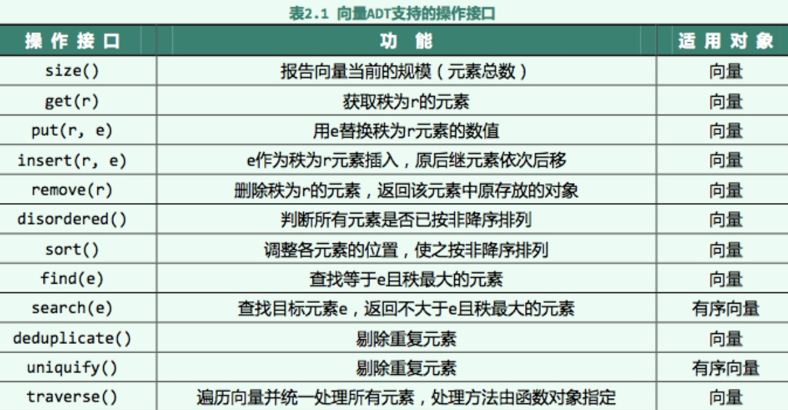

### 单链表
1. 单向链表，它包含两个域，一个`信息域和一个指针域`。
2. 单向链表，链接指向表中的下一个节点，而最后一个节点则指向一个空值NULL。
3. 单向链表只可向一个方向遍历。
4. 查找一个节点的时候需要从第一个节点开始每次访问下一个节点，一直访问到需要的位置。
5. 也可以提前把一个节点的位置另外保存起来，然后直接访问。
### 双链表
1. 双向链表中不仅有指向后一个节点的指针，还有指向前一个节点的指针。
2. 双向链表第一个节点的"前连接"指向NULL，最后一个节点的"后连接"指向NULL。
3. 双向链表可以从任何一个节点访问前一个节点，也可以访问后一个节点，以至整个链表。
4. 双向链表一般是在需要大批量的另外储存数据在链表中的位置的时候用。
5. 双向链表由于另外储存了指向链表内容的指针，并且可能会修改相邻的节点，有的时候第一个节点可能会被删双向链表除或者在之前添加一个新的节点。这时候就要修改指向首个节点的指针。
6. 双向链表有一种方便的可以消除这种特殊情况的方法是在最后一个节点之后、第一个节点之前储存一个永远不会被删除或者移动的虚拟节点，形成一个循环链表。这个虚拟节点之后的节点就是真正的第一个节点。这种情况通常可以用这个虚拟节点直接表示这个链表。
### 环形链表
1. 循环链表,首节点和末节点被连接在一起。这种方式在单向和双向链表中皆可实现。
2. 要转换一个循环链表，你开始于任意一个节点然后沿着列表的任一方向直到返回开始的节点。
3. 循环链表可以被视为"无头无尾"。循环链表中第一个节点之前就是最后一个节点，反之亦然。循环链表的无边界使得在这样的链表上设计算法会比普通链表更加容易。
4. 对于新加入的节点应该是在第一个节点之前还是最后一个节点之后可以根据实际要求灵活处理，区别不大。
5. 另外有一种模拟的循环链表，就是在访问到最后一个节点之后的时候，手工跳转到第一个节点。访问到第一个节点之前的时候也一样。这样也可以实现循环链表的功能，在直接用循环链表比较麻烦或者可能会出现问题的时候可以用。

### 带哨兵节点链表
1. 不带哨兵节点的双向链表在做查找删除节点等操作的时候，免不了要判断边界条件，比如node==NULL等。每次判断边界条件，虽然不会从根本上增加时间复杂度，但是对其常数项还是有影响的
2. 带哨兵节点构成的双向循环链表，则可以省去这些问题。我们使用一个“哑的”NIL节点来代替之前的head头指针，NIL节点的key值没有实际的意义，主要关注它的next和pre，初始的时候，链表只有一个NIL节点，NIL.next指向自己，NIL.pre也指向自己。当添加了若干个节点之后，NIL.next指向头节点，而NIL.pre则指向尾节点；而同样的，这时头节点的pre不再是NULL而是指向NIL，尾节点的next也不再是NULL，也是指向NIL。       
3. 不带哨兵节点的双向链表这样的好处在于，我们判断边界条件的时候，不需要再判断是否为空，尤其在删除节点的时候。
4. 带哨兵节点构成的双向循环链表，要额外分配空间来存储NIL节点，如果对于多个比较短的链表而言，这样可能会代码比较大的冗余空间。

#### 栈的基本概念和性质

栈是LIFO（Last In First Out），先存进去的数据只能最后被取出来，进出顺序逆序，即先进后出，后进先出。

* 栈ADT及其顺序

（1）`ADT`：
  ADT Stack{
    数据对象：D={ai|ai属于ElemSet，i=1,2,...,n，n>=0}
    数据关系：R1={<ai-1,ai>|ai-1, ai属于D，i=2，...，n}
    约定an端为栈顶，a1端为栈底。	
    基本操作：
    InitStack(&S)		操作结果：构造一个空栈S。
    DestroyStack(&S)	初始条件：栈S已存在		操作结果：栈S被销毁
    ClearStack(&S)		初始条件：栈S已存在		操作结果：将S清为空栈
    StackEmpty(S)		初始条件：栈S已存在		操作结果：若栈S为空栈，则返回TRUE，否则FALSE
    StackLength(S)		初始条件：栈S已存在		操作结果：返回S的元素个数，即栈的长度
    GetTop(S, &e)		初始条件：栈S已存在且非空	操作结果：用e返回S的栈顶元素
    Push(&S, e)		初始条件：栈S已存在		操作结果：插入元素e为新的栈顶元素
    Pop(&S, &e)		初始条件：栈S已存在且非空	操作结果：删除S的栈顶元素，并用e返回其值
    StackTraverse(S, visit())	初始条件：栈S已存在并非空
    操作结果：从栈底到栈顶依次对S的每个数据元素调用函数visit()，一旦visit()失败，则返回操作失败。
  }ADT Stack 

（2）顺序： 先进后出

（3）定义：
```c
  // 顺序栈的定义
  typedef struct {
    int data[maxSize];
    int top;
  }sqStack;

  // 链栈节点定义
  typedef struct LNode{
    int data;
    struct LNode *next
  }LNode;
```

（4）应用：

  有数制转换、括号匹配的检验等。

#### 队列的基本概念和性质

1. 队列是一种线性集合，其元素一端加入，从另一端删除，因此我们说队列元素是按先进先出（FIFO）方式处理。
2. 队列的处理过程：通常队列会画成水平，其中一端作为队列的前端（front）也称队首（head）,另一端作为队列的末端（rear）也称队尾（tail）。元素都是从队列末端进入，从队列前端退出。
3. 在队列中，其处理过程可在队列的两端进行，而在栈中，其处理过程只在栈的一端进行，但两者也有相似之处，与栈类似，队列中也没有操作能让用户“抵达”队列中部，同样也没有操作允许用户重组或删除多个元素。


* 队列ADT及其顺序
（1）`ADT`：
  ADT Queue{
    数据对象：D={ai|ai属于ElemSet，i=1,2,...,n，n>=0}
    数据关系：R1={<ai-1,ai>|ai-1, ai属于D，i=2，...，n}
    约定a1端为队列头，an端为队列尾。	
    基本操作：
    InitQueue(&Q)		操作结果：构造一个空队列Q。
    DestroyQueue(&Q)	初始条件：队列Q已存在		操作结果：队列Q被销毁
    ClearQueue(&Q)		初始条件：队列Q已存在		操作结果：队列Q清为空栈
    QueueEmpty(Q)		初始条件：队列Q已存在		操作结果：若队列Q为空栈，则返回TRUE，否则FALSE
    QueueLength(Q)		初始条件：队列Q已存在		操作结果：返回Q的元素个数，即队列的长度
    GetHead(Q, &e)		初始条件：队列Q非空			操作结果：用e返回Q的对头元素
    EnQueue(&Q, e)		初始条件：队列Q已存在		操作结果：插入元素e为Q的新队尾元素
    DeQueue(&Q, &e)		初始条件：队列Q已存在且非空	操作结果：删除Q的队头元素，并用e返回其值
    QueueTraverse(S, visit())	初始条件：队列Q已存在并非空
    操作结果：从队头到队尾，依次对Q的每个数据元素调用函数visit()，一旦visit()失败，则返回操作失败。
  }ADT Queue

（2）顺序： 先进先出

（3）定义：
```c
// 顺序队列的定义
typedef struct {
  int data[maxSize];
  int front;            // 队首指针
  int rear;             // 队尾指针
}

// 链队定义
typedef struct QNode{
  int data;
  struct QNode *next
}QNode

typedef struct{
  QNode *front;         // 队头指针
  QNode *rear;          // 队尾指针
}

// 顺序队进队算法
int enQueue(SqQueue &qu, int x){
  if((qu.rear + 1) % maxSize == qu.front){ // 队满的判断条件
    return 0;
  }

  qu.rear = (qu.rear + 1) % maxSize;       // 若队未满，则先移动指针
  x = qu.data[qu.front];                       // 再取出数据
  retuen 1;
}

// 顺序队进队算法
int deQueue(SqQueue &qu, int &x){
  if(qu.front == qu.rear){                 // 若队空，则不能出队
    return 0;
  }

  qu.front = (qu.front) % maxSize;         // 若队不空，则先移动指针
  x = qu.data[qu.front];                   // 再取出数据
  return 1;
}
```

（4）应用：
  模拟售票口

#### 向量基本概念和性质
1. `对数组结构进行抽象与扩展`之后，就可以得到向量结构，因此向量也称作数组列表（Array list）。
2. 向量提供一些访问方法，使得我们可以通过下标直接访问序列中的元素，也可以将指定下标处的元素删除，或将新元素插入至指定下标。为了与通常数组结构的下标（Index）概念区分开来，我们通常将序列的下标称为秩（Rank）。
3. 假定集合 S 由n 个元素组成，它们按照线性次序存放，于是我们就可以直接访问其中的第一个元素、第二个元素、第三个元素……。也就是说，通过[0, n-1]之间的每一个整数，都可以直接访问到唯一的元素e，而这个整数就等于S 中位于e 之前的元素个数——在此，我们称之为该元素的秩（Rank）。
4. 不难看出，若元素e 的秩为r，则只要e 的直接前驱（或直接后继）存在，其秩就是r-1（或r+1）。
5. 支持通过秩直接访问其中元素的序列，称作向量（Vector）或数组列表（Array list）。
6. 实际上，秩这一直观概念的功能非常强大——它可以直接指定插入或删除元素的位置。 


* 向量ADT及其顺序

（1）ADT



