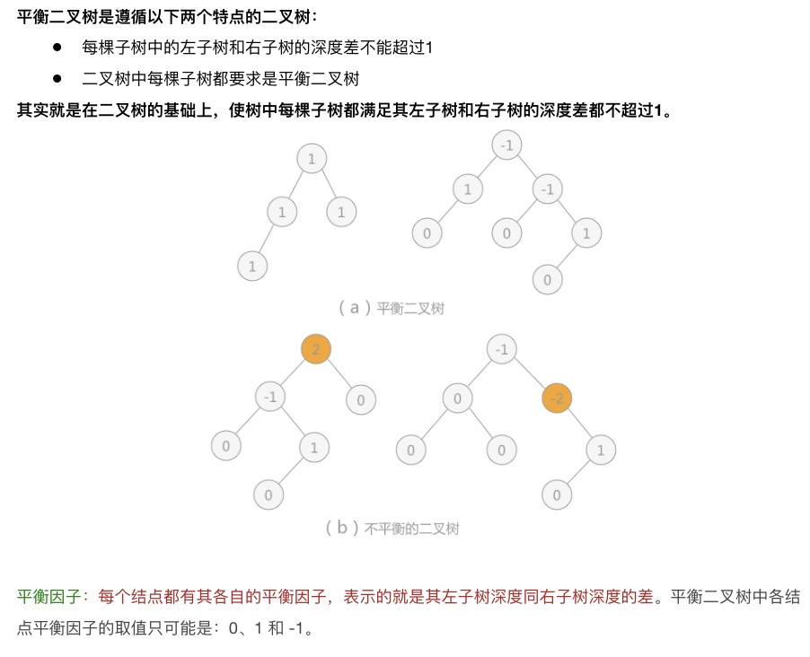

## 知识结构


### 顺序查找
> 一般线性表的顺序查找

```c
typedef struct{         
  ElemType *elem;         // 0号留空
  int TableLen;           // 表的长度
}SSTable

int Search_Seq(SSTable ST, ElemType key){
  ST.elem[0]=key;                                 // 哨兵 （引入目的是使得Search_Seq内循环不必判断数组是否会越界，避免了判断语句，从而提高程序效率）
  for(i=ST.TableLen; ST.elem[i]!=key;--1);        // 从后往前找
  return i;                                       // 若表中不存在关键字为key的元素，将查找到i为0时推出for循环
}
```
### 二分查找

```c
int Binary_Search(SeqList L, ElemType key){

  int low=0, high=L.TableLen-1, mid;
  while(low<=high){
    mid=(low+high)/2;       // 取中间位置
    if(L.elem[mid]==key){
      return mid;           // 查找成功则返回所在位置
    }else if(L.elem[mid]>key){
      high=mid-1;           // 从前半部分继续查找
    }else{
      low=mid+1;            // 从后半部分继续查找
    }
  }
  return -1;                // 查找失败返回-1
}
```

### 二叉排序树（BST）

* 定义以及性质
二叉排序树要么是空树，要么具有如下特点
  二叉排序树中，如果其根节点有左子树，那么左子树上的所有节点都小于根节点的值
  二叉排序树中，如果其根节点有右子树，那么右子树上的所有节点都大于根节点的值
  二叉排序树的左右子树也要求都是二叉排序树

* ADT及其实现

* 二叉平衡树查找、插入、删除


* `构造`实现
```c
void Creat_BST(BiTree &T, KeyType str[], int n){
  T=NULL;              // 初始时T为空树
  int i=0;
  while(i < n){        // 依次将每个关键字插到二叉排序树中
    BST_Insert(T, str[i]);
    i++;
  }
}
```

* `查找`实现（非递归实现）
```c
BSTNode *BST_Search(BiTree T, ElemType key){
  while(T != NULL && key != T->data){
    if(key < T->data) T=T->lchild;           // 小于，则在左子树上查找
    else T=T->rchild;
  }
}
```

* `插入`实现
```c
int BST_Insert(BiTree &T, KeyType k){
  if(T == NULL){                         // 原树为空
    T=(BiTree)malloc(sizeof(BSTNode));
    T->key=k;
    T->lchild = T->rchild = NULL;
    return 1;                            // 返回 1，插入成功
  }else if(k == T->key){
    return 0;
  }else if(k < T->key){                  // 插入到T的左子树
    return BST_Insert(T->lchild, k)
  }else {
    return BST_Insert(T->rchild, k)         // 插入到T的右子树
  }
}
```


* `删除`实现


### 二叉平衡树（AVL）



### Hash查找

这块主要讲了：
（1）利用一个合适的Hash函数“避免冲突”；
（2）如果发生冲突了，怎么处理


* 常见的Hash函数（直接定址法、随机数法）

`散列函数的构造：构造哈希表的前提是要有哈希函数，并且这个函数尽可能地减小冲突`

（1）`直接定址法（考纲点明）`
  可以取关键字的某个线性函数值为散列地址，即：
  `f(key) = a*key + b`
>  这样的哈希函数简单均匀，不会产生冲突，但问题是这需要事先知道关键字的分布情况，并且关键字分布基本连线的情况，若关键字分布不连续，空位较多，则会造成存储空间浪费

（2）数字分析法
> 该方法在知道关键字的情况下，取关键字的尽量不重复的几位值组成散列地址。

（3）平方取中法
> 取关键字平方后的中间几位为散列地址

（4）折叠法
> 将关键字分为位数相等的几部分，最后一部分的位数可以不等，然后把这几部分的值（舍去进位）相加作为散列地址。

（5）除留余数法
> 该方法为最常用的构造哈希函数方法，对于散列表长为m的散列函数公式为
  `f(key) = key % p (p<=m)`
> 使用除留余数法的一个经验是，若散列表表长为m，通常p为小于或等于表长的最小质数或不包含小于20质因子的合数。
> 实践证明，当p取小于散列表长的最大质数时，函数较好。

（6）`随机数法（考纲点明）`
> 选择一随机函数，取关键字的随机值作为散列地址，通常用于关键字长度不同的场合。

* hash冲突概念、解决的办法（开散列方法/拉链法、闭散列方法/开放定址法）

解决冲突的方法：
(1)`开放定址法（考纲点明）`
    一旦发生冲突，就去寻找下一个空的散列地址，只要散列表足够大，空的散列地址总能找到，并将记录存入，公式：
            `fi(key) = (H(key)+di) % m (di=1,2,3...m-1)`
    其中`H(key)`表示哈希函数；`m`表示哈希表表长；`di`为增量序列；

    当冲突发生时，使用某种探测技术在散列表中形成一个探测序列，沿此序列逐个单元地查找，直到找到给定的关键字，或者碰到一个开放的地址（该地址单元为空）为止(若要插入，在探查到开放的地址，则可将带插入的新节点存入该地址单元)。查找时探测到开放的地址则表明表中无待查的关键字，即查找失败。

* 线性探测法
```shell
比如说: 
  我们的关键字集合为{12,67,56,16,25,37,22,29,15,47,48,34}，表长为12。 我们用散列函数
            `f(key) = key mod 12。`
  当计算前S个数{12,67,56,16,25}时，都是没有冲突的散列地址，直接存入， 计算key = 37时，
  发现f(37) = 1，此时就与25所在的位置冲突。
  于是我们应用上面的公式f(37) = (f(37)+1) mod 12 = 2。于是将37存入下标为2的位置。这其实就是房子被人买了于是买下一间的作法：接下来22,29,15,47都没有冲突，正常的存入：到了 key=48，我们计算得到f(48) = 0，与12所在的0位置冲突了，不要紧，我们f(48) = (f(48)+1) mod 12 = 1，此时又与25所在的位置冲突。于是f(48) = (f(48)+2) mod 12=2，还是冲突……一直到 f(48) = (f(48)+6) mod 12 = 6时，才有空位，机不可失，赶快存入：
  我们把这种解决冲突的开放定址法称为线性探测法。
```
* 二次探测法
```shell
  考虑深一步，如果发生这样的情况，当最后一个key=34，f(key)=10，与22所在的位置冲突，可是22后面没有空位置了，反而它的前面有一个空位置，尽管可以不断地求余数后得到结果，但效率很差。
  因此我们可以改进di = 1^2, -1^2, 2^2, -2^2,……, q^2, -q^2 (q <= m/2)，这样就等于是可以双向寻找到可能的空位置。
  对于34来说，我们取di即可找到空位置了。另外增加平方运算的目的是为了不让关键字都聚集在某一块区域。我们称这种方法为二次探测法。
    `fi(key) = (f(key)+di) MOD m (di = 1^2, -1^2, 2^2, -2^2,……, q^2, -q^2, q <= m/2)`
```

* 伪随机探测法
```shell
  还有一种方法，是在冲突时，对于位移量di采用随机函数计算得到，我们称之为随机探测法。
  此时一定会有人问，既然是随机，那么查找的时候不也随机生成吗？如何可以获得相同的地址呢？这是个问题。这里的随机其实是伪随机数。
  伪随机数是说，如果我们设置随机种子相同，则不断调用随机函数可以生成不会重复的数列，我们在査找时，用同样的随机种子，它每次得到的数列是相同的，相同的di当然可以得到相同的散列地址。
    `fi(key) = (f(key)+di) MOD m (di是一个随机数列)`
```

* 再哈希法
```shell
  需要使用两个哈希函数，当通过第一个哈希函数H(key)得到的地址发生冲突时，则利用第二个哈希函数Hash2(key)计算该关键字的地址增量。它的具体哈希函数形式如下:
      `Hi=(H(key) + i*Hash2(key))%m`
  初始探测位置H0=H(key)%m， i是冲突的次数， 初始为0。在再哈希法中，最多进行m-1次探测就会遍历表中所有位置，回到H0位置
```

总之，开放定址法只要在散列表未填满时，总是能找到不发生冲突的地址，是我们常用的解决冲突的办法。

(2)`链地址法（拉链法）（考纲点明）`

链地址法解决冲突的做法是：

```shell
将所有关键字散列地址相同的结点链接在同一个单链表中。若选定的散列表长度为m，则可将散列表定义为一个由m个头指针组成的指针数组T[0..m-1]。凡是散列地址为i的结点，均插入到以T[i]为头指针的单链表中。T中各分量的初值均应为空指针。在拉链法中，装填因子α可以大于1，但一般均取α≤1。
前面我们谈到了散列冲突处理的开放定址法，它的思路就是一旦发生了冲突，就去寻找下一个空的散列地址。那么，有冲突就非要换地方吗？我们直接就在原地处理行不行呢？
可以的，于是我们就有了链地址法。
将所有关键字散列地址相同的记录存储在一个单链表中，我们称这种表为同义词子表，在散列表中只存储所有同义词子表的头指针。
```


* 二次聚集现象
`开放定址法会造成二次聚集的现象，对查找不利。`
我们可以看到一个现象：当表中i,i+1,i+2位置上已经填有记录时，下一个哈希地址为i,i+1,i+2和i+3的记录都将填入i+3的位置，`这种在处理冲突过程中发生的两个第一个哈希地址不同的记录争夺同一个后继哈希地址的现象称为“二次聚集”`，即在处理同义词的冲突过程中又添加了非同义词的冲突。但另一方面，用线性探测再散列处理冲突可以保证做到：只要哈希表未填满，总能找到一个不发生冲突的地址Hk。而二次探测再散列只有在哈希表长m为形如4j+3（j为整数）的素数时才可能。


### 优先队列与堆

* 队列


* 堆


