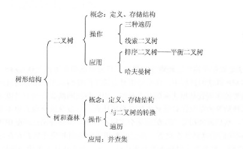
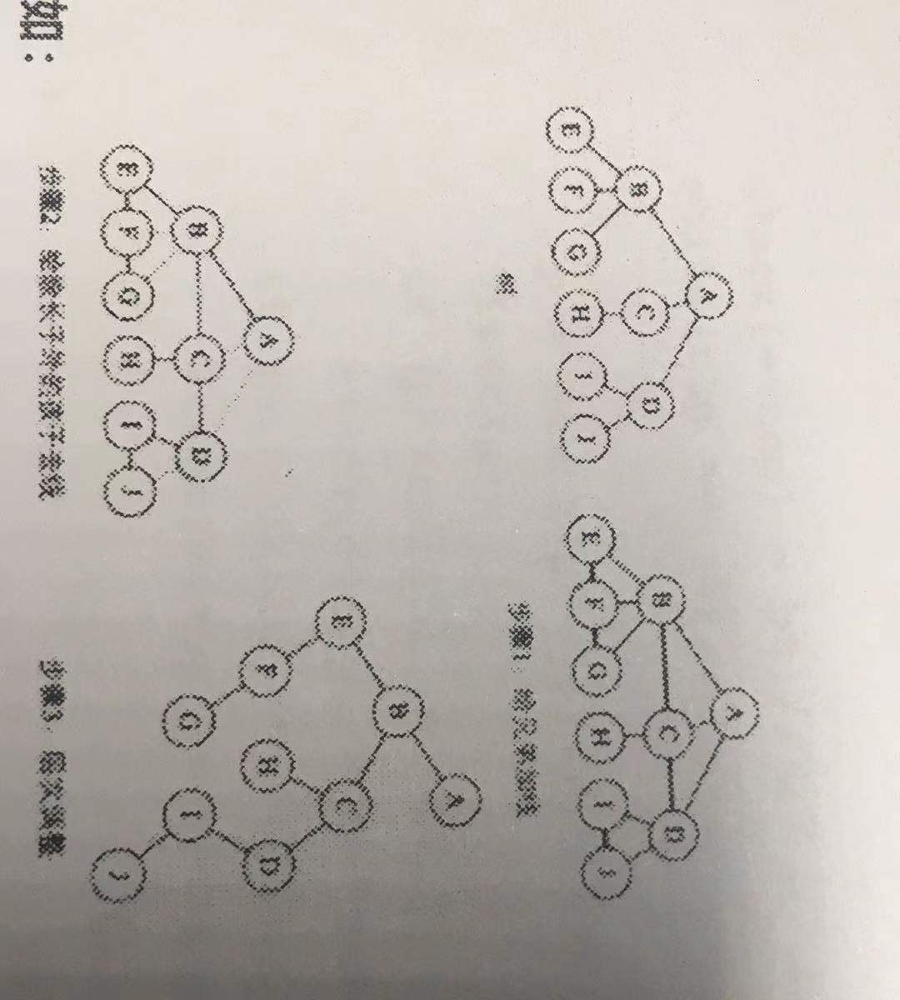
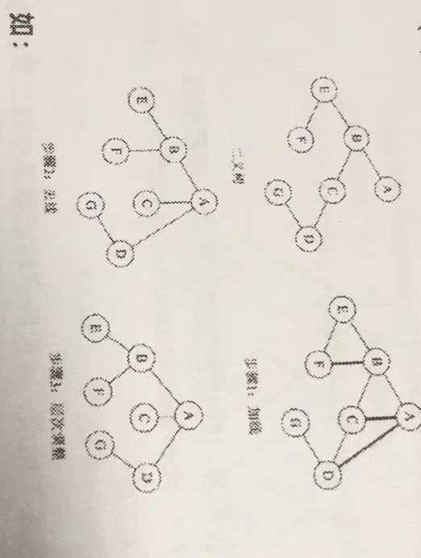

## 知识结构


#### 二叉树存储

* 顺序存储：
二叉树的顺序存储是指用一组地址连续的存储单元依次自上而下、自左至右存储完全二叉树上的节点
（完全二叉树、满二叉树采用顺序存储比较合适）


* 链式存储：
由于顺序存储空间利用率较低，所以二叉树一般采用链式存储结构

```c
typedef struct BiTNode{
  ElemType data;                              // 数据域
  struct BitNode *lchild, *rchild;            // 左孩子、右孩子指针
}BiTNode, *BiTNode;
```

#### 二叉树的先序、中序、后序

* （1）先序

```c
// 递归实现
void PreOrder(BiTree T){
  if(T!=NULL){
    visit(T);
    PreOrder(T->lchild);
    PreOrder(T->rchild);
  }
}


// 非递归实现
void PreTraverseTreel2(TreeNode T){
  // BTNode *Stack[maxSize];
  // int top=-1;
  // BTNode *p;
  // if(bt != NULL){
  //   Stack[++top] = bt;    // 根节点入栈
  //   while(top == -1){
  //     p = Stack[p--];     // 出栈并输出栈顶节点
  //     Visit(p);
  //     if(p->rchild != NULL) Stack[++top] = p->rchild;
  //     if(p->lchild != NULL) Stack[++top] = p->lchild;
  //   }
  // }

  InitStack(S);
  BiTree p = 
}
```

* （2）中序

```c
// 递归实现
void InOrder(BiTree T){
  if(T!=NULL){              
    PreOrder(T->lchild);
    visit(T);
    PreOrder(T->rchild);
  }
}

// 非递归写法
void InOrder2(BiTree T){
  InitStack(S);                      // 初始化栈S； p是遍历指针
  BiTree p = T;
  while(p || IsEmpty(S)){            // 栈不空或p不空时循环
    if(p){
      Push(S, p);
      p=p->lchild;
    }else{
      Pop(S, p);
      visit(p);
      p=p->rchild;
    }
  }
}

```

* （3）后序

```c
// 递归实现
void PostOrder(BiTree T){
  if(T!=NULL){
    PreOrder(T->lchild);
    PreOrder(T->rchild);
    visit(T);
  }
}

```

#### 二叉树及其性质
（1）二叉树性质：
  > 1、二叉树每个节点最多具有两个子树，即二叉树的度只能为0、1、2
  > 2、子树有左右之分不能颠倒

  > 3、`非空二叉树上叶子节点数等于双分支节点树加1`
  > 4、`二叉树第i层上最多有2^(n+1) 个节点，其中i>=1`
  > 5、`高度为k的二叉树最多有2^k - 1个节点，其中k>=1`
  > 6、`具有n个节点的完全二叉树的高度为(log2n) + 1`

（2）满二叉树：
> 所有分支都有左孩子和右孩子节点，并且叶子节点都集中在二叉树最下面一层

（3）完全二叉树：
> 是一棵满二叉树从右至左从下至上，挨个删除节点所得到的，如果跳着删除，则得不到完全二叉树

#### 树的基本概念和术语

#### 普通树与二叉树的转换

* 森林转二叉树

> 将节点的孩子放在左子树; 将节点的兄弟放在右子树

* 树转二叉树

> （1）加线：在所有兄弟节点之间加一条线
> （2）去线：将每个节点的分支从左往右除了第一个以外，其余都剪掉。
> （3）调整：以树的跟节点为轴心，将整个树调整一下，使之符合二叉树的层次结构



* 二叉树转树

> （1）加线：若某个节点x的左孩子节点存在，则将这个左孩子的右孩子节点、右孩子的右孩子节点、右孩子的右孩子的右孩子节点...，都作为节点x的孩子。将节点x与这些右孩子节点用线连接起来
> （2）去线：删除原二叉树中所有节点与其右孩子节点的连线
> （3）调整：层次调整



* 二叉树转为森林
（假若一颗二叉树的根节点有右孩子，则这颗二叉树能够转化为森林，否则将转换为一棵树）

> 从根节点开始，若右孩子存在，则把与右孩子节点的连线删除。再查看分离之后的二叉树，若其根节点的右孩子存在，则连线删除...。直到所有这些根节点与右孩子的连线都删除为止。
> 将每棵分离后的二叉树转换为树

#### 树的存储结构，标准形式

* 1、利用链表组织树中的各个节点
* 2、链表中的前后关系不代表节点间的逻辑关系
* 3、节点的逻辑关系由child数据域描述
* 4、child数据域保存其他节点的存储地址

#### 完全树的数组形式存储

#### 树的应用


#### Huffman树的定义与应用

定义：Huffman树又称最优二叉树，它是由n个带权叶子节点构成的所有二叉树中，带权路径长度最小的二叉树

> 其中：
> 1、路径：是指从树的一个节点到另一个节点的分支所构成的路线
> 2、路径长度：是指分支上的分支数目
> 3、树的路径长度：从根到每个节点的路径长度之和。
> 4、树的带权路径长度：树中所有叶子节点的带权路径长度之和

特点：
（1）权值越大的点，距离根节点越近
（2）树中没有度为1的点，这类树又叫正则二叉树
（3）树的带权路径长度最短

哈夫曼编码： 在哈夫曼树上，左分支为0，右分支为1，从根节点开始，直到叶子节点所组成的编码序列

