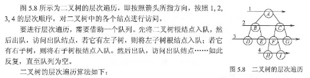
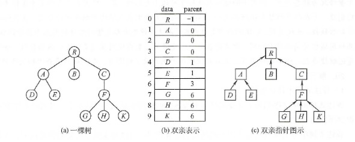
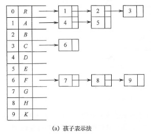
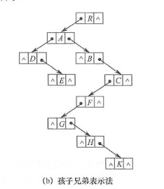
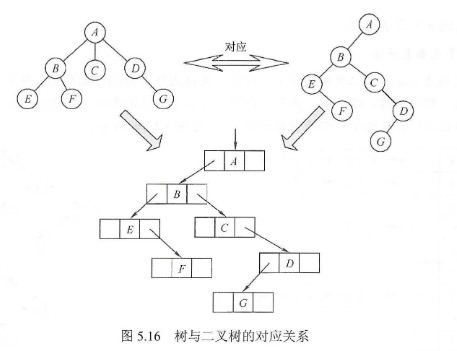
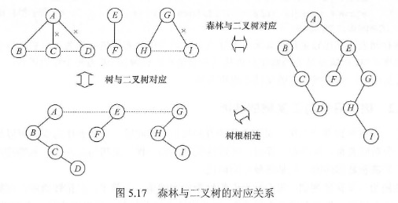
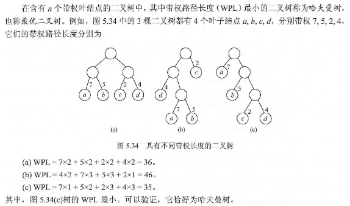
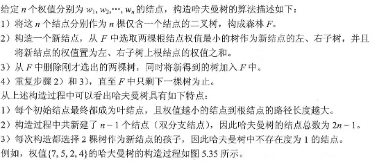
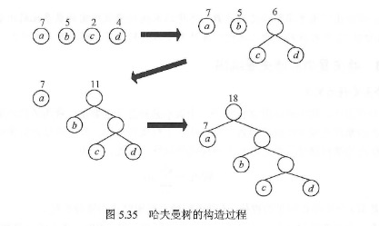
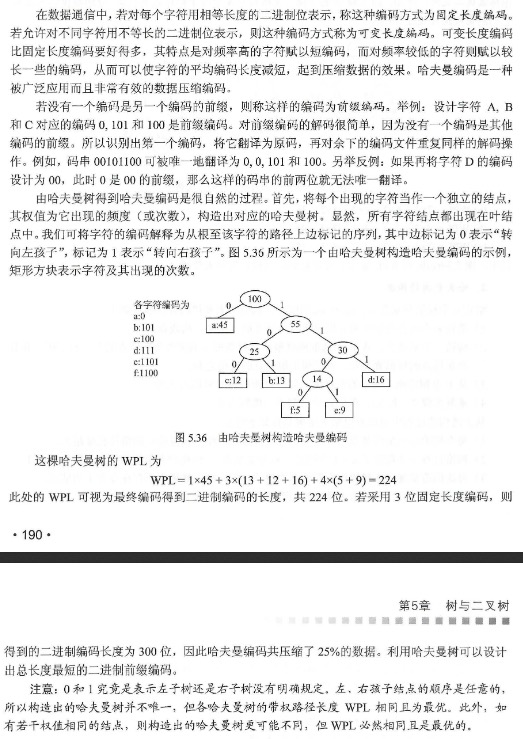

# 知识结构


## 一、二叉树
#### 二叉树及其性质
（1）二叉树性质：
  > 1、二叉树每个节点最多具有两个子树，即二叉树的度只能为0、1、2
  > 2、子树有左右之分不能颠倒

  > 3、`非空二叉树上叶子节点数等于双分支节点树加1`
  > 4、`二叉树第i层上最多有2^(n-1) 个节点，其中i>=1`
  > 5、`高度为k的二叉树最多有2^k - 1个节点，其中k>=1`
  > 6、`具有n个节点的完全二叉树的高度为log2(n+1)`

（2）满二叉树：
> 所有分支都有左孩子和右孩子节点，并且叶子节点都集中在二叉树最下面一层

特点
  1）一棵深度为k且有2k－1个结点的二叉树
  2）可以对满二叉树的结点进行连续编号，约定编号从根开始，自上而下

（3）完全二叉树：
> 是一棵满二叉树从右至左从下至上，挨个删除节点所得到的，如果跳着删除，则得不到完全二叉树

特点
  1）叶子结点只可能出现在层次最大的两层上
  2）对任一结点，若其右分支下子孙的最大层次为l，其左下分支的子孙的最大层次必为l或者l＋1
  3）深度为k的完全二叉树第k层最少1个结点，最多2k-1-1个结点；整棵树最少2k-1个结点，最多2k-2个结点
  4）具有n个结点的完全二叉树的深度为[log2n]+1


#### 二叉树存储

* 顺序存储：
二叉树的顺序存储是指用一组地址连续的存储单元依次自上而下、自左至右存储完全二叉树上的节点
（完全二叉树、满二叉树采用顺序存储比较合适）


* 链式存储：
由于顺序存储空间利用率较低，所以二叉树一般采用链式存储结构

```c
typedef struct BiTNode{
  ElemType data;                              // 数据域
  struct BitNode *lchild, *rchild;            // 左孩子、右孩子指针
}BiTNode, *BiTNode;
```

#### 二叉树的先序、中序、后序

* （1）先序

```c
// 递归实现
void PreOrder(BiTree T){
  if(T!=NULL){
    visit(T);
    PreOrder(T->lchild);
    PreOrder(T->rchild);
  }
}

// 非递归写法
void PreOrder2(BiTree T){
  InitStack(S);                      // 初始化栈S； p是遍历指针
  BiTree p = T;
  while(p || IsEmpty(S)){            // 栈不空或p不空时循环
    if(p){                           // 一路向左
      visit(p);                      // 访问当前节点
      Push(S, p);                    // 当前节点入栈
      p=p->lchild;                   // 当左孩子不空，一直向左走
    }else{                           // 出栈，并转向出栈节点的右子树
      Pop(S, p);                     // 找顶元素出栈
      p=p->rchild;                   // 向右子树走，p赋值为当前节点的右孩子
    }                                // 返回while循环继续进入if-else语句
  }
}
```

* （2）中序

```c
// 递归实现
void InOrder(BiTree T){
  if(T!=NULL){              
    PreOrder(T->lchild);
    visit(T);
    PreOrder(T->rchild);
  }
}

// 非递归写法
void InOrder2(BiTree T){
  InitStack(S);                      // 初始化栈S； p是遍历指针
  BiTree p = T;
  while(p || IsEmpty(S)){            // 栈不空或p不空时循环
    if(p){                           // 一路向左
      Push(S, p);                    // 当前节点入栈
      p=p->lchild;                   // 当左孩子不空，一直向左走
    }else{                           // 出栈，并转向出栈节点的右子树
      Pop(S, p);                     // 找顶元素出栈
      visit(p);                      // 访问出栈节点
      p=p->rchild;                   // 向右子树走，p赋值为当前节点的右孩子
    }                                // 返回while循环继续进入if-else语句
  }
}

```

* （3）后序

```c
// 递归实现
void PostOrder(BiTree T){
  if(T!=NULL){
    PreOrder(T->lchild);
    PreOrder(T->rchild);
    visit(T);
  }
}

```

#### 二叉树层次遍历


```c
void LevelOrder(BiTree T){
  InitQueue(Q);                 // 初始化辅助队列
  BiTree p;                  
  EnQueue(Q, T);                // 将根节点入队
  while(!IsEmpty(Q)){           // 队列不为空则循环
    DeQueue(Q, p);              // 队头节点出队
    visit(p);                   // 访问出队节点
    if(p->lchild != NULL){
      EnQueue(Q, p->lchild);    // 左子树不空，则左子树根节点入队
    }
    if(p->rchild != NULL){
      EnQueue(Q, p->rchild);    // 右子树不空，则右子树根节点入队
    }
  }
}


```
 

## 树、森林
#### 树的基本概念和术语

基本概念：树（Tree）是n（n>=0）个结点的有限集

术语：
  节点的度：一个节点含有的子树的个数称为该节点的度；
  叶节点或终端节点：度为0的节点称为叶节点；
  非终端节点或分支节点：度不为0的节点；
  双亲节点或父节点：若一个节点含有子节点，则这个节点称为其子节点的父节点；
  孩子节点或子节点：一个节点含有的子树的根节点称为该节点的子节点；
  兄弟节点：具有相同父节点的节点互称为兄弟节点；
  树的度：一棵树中，最大的节点的度称为树的度；
  节点的层次：从根开始定义起，根为第1层，根的子节点为第2层，以此类推；
  树的高度或深度：树中节点的最大层次；
  堂兄弟节点：双亲在同一层的节点互为堂兄弟；
  节点的祖先：从根到该节点所经分支上的所有节点；
  子孙：以某节点为根的子树中任一节点都称为该节点的子孙。
  森林：由m（m>=0）棵互不相交的树的集合称为

#### 树的存储结构，标准形式

* 树的存储形式

（1）双亲表示法



```c
#define MAX_TRUE_SIZE 100              // 树中最多节点数
typedef struct{
  ElemType data;                       // 数据元素
  int parent;                          // 双亲位置域
}PTNode;

typedef struct{                        // 树的类型定义
  PTNode nodes[MAX_TRUE_SIZE];         // 双亲表示
  int n;                               // 节点数
}PTree
```

注意：

（2）孩子表示法
> 孩子表示法是将每个节点的孩子节点都用单链表链接起来形成一个线性结构，此时n个节点就有n个孩子链表（叶子节点的孩子链表为空表）;

> 这种存储方式寻找子女的操作非常直接，而寻找双亲的操作需要遍历n个节点中孩子链表指针域所指向的n个孩子链表



（3）孩子兄弟表示法
> 孩子兄弟表示法，又称二叉树表示法，即以二叉链表作为树的存储结构。孩子兄弟表示法使每个节点包括三部分内容：节点值、指向节点第一个孩子节点的指针，以及指向节点下一个兄弟节点的指针

`孩子兄弟表示法存储结构: `
```c
typedef struct CSNode{
  ElemType data;                      // 数据域
  struct CSNode *firstchild, *nextsibling;   // 第一个孩子和右兄弟指针
}
```


#### 普通树与二叉树的转换

* “树” => “二叉树” 的规则：
> 每个节点左指针指向他的第一个孩子，右指针指向它在树中的相邻右兄弟，这个规则又称“左孩子右兄弟”。由于根节点没有兄弟，所以对应的二叉树没有右子树

> 画法：
>（1）在兄弟节点之间加一条线
>（2）对每个节点，只保留它与第一个孩子的连线，而与其他孩子的连线全部抹掉
>（3）以树根为轴心，顺时针旋转45度

* “森林” => “二叉树” 的规则：
> 与树类似，先将森林中每棵树转换为二叉树，由于任何一颗和树对应的二叉树的右子树必空，若把森林中第二棵树根视为第一颗树根的右兄弟，即将第二棵树对应的二叉树当作第一棵二叉树根的右子树，将第三棵树对应的二叉树当作第二棵二叉树根的右子树...以此类推



> 画法：
>（1）将森林中的每棵树转化成相应的二叉树；
>（2）每棵树的根也可以视为兄弟关系，在每棵树的根之间加一根连线
>（3）以第一棵树的根为轴心顺时针旋转45度

* “二叉树” => “森林” 的规则：
> 若二叉树非空，则二叉树的根及其左子树为第一棵树的二叉树形式，故将根的右链断开。二叉树根的右子树又可视为一个由除第一棵树外的森林转换后的二叉树，应用同样的方法，直到最后只剩一棵没有右子树的二叉树为止，最后再将每棵二叉树依次转换成树，就得到了原森林



<!-- 另外资料

* 森林转二叉树

> 将节点的孩子放在左子树; 将节点的兄弟放在右子树

* 树转二叉树

> （1）加线：在所有兄弟节点之间加一条线
> （2）去线：将每个节点的分支从左往右除了第一个以外，其余都剪掉。
> （3）调整：以树的跟节点为轴心，将整个树调整一下，使之符合二叉树的层次结构


* 二叉树转树

> （1）加线：若某个节点x的左孩子节点存在，则将这个左孩子的右孩子节点、右孩子的右孩子节点、右孩子的右孩子的右孩子节点...，都作为节点x的孩子。将节点x与这些右孩子节点用线连接起来
> （2）去线：删除原二叉树中所有节点与其右孩子节点的连线
> （3）调整：层次调整


* 二叉树转为森林
（假若一颗二叉树的根节点有右孩子，则这颗二叉树能够转化为森林，否则将转换为一棵树）

> 从根节点开始，若右孩子存在，则把与右孩子节点的连线删除。再查看分离之后的二叉树，若其根节点的右孩子存在，则连线删除...。直到所有这些根节点与右孩子的连线都删除为止。
> 将每棵分离后的二叉树转换为树 -->

#### 树的应用
> 二叉排序树
> 二叉平衡树


#### Huffman树
##### （1）哈夫曼树的定义
* 定义：Huffman树又称最优二叉树，它是由n个带权叶子节点构成的所有二叉树中，带权路径长度最小的二叉树

> 其中：
> 1、该“节点的权：树中节点被赋予表示某种意义数值
> 2、路径长度：从树根到任意节点经过的边数
> 3、该“节点的带权路径长度”：该路径长度与该节点上权值的乘积
> 4、该“树的带权路径长度”：树中所有叶子节点的带权路径长度之和



* 构造：



* 特点：
（1）权值越大的点，距离根节点越近
（2）树中没有度为1的点，这类树又叫正则二叉树
（3）树的带权路径长度最短

##### （2）哈夫曼编码： 
在哈夫曼树上，左分支为0，右分支为1，从根节点开始，直到叶子节点所组成的编码序列



