### 1、图的基本概念

（1）`有向图`
（2）`无向图`
（3）`简单图`
（4）`多重图`
（5）`子图`
（6）`连通、连通图和连通分量`
（7）`强连通图、强连通分量`
（8）`生成树、生成森林`
（9）`顶点的度、入度和出度`
（10）`边的权和网`
（11）`稠密图、稀疏图`
（12）`路径、路径长度和回路`
（13）`简单路径、简单回路`
（14）`距离`

（15）`有向树`：一个顶点的入度为0、其余顶点的入度均为1的有向图，称为有向树

（16）`完全树（也称简单完全树）`：对于无向图来说，如果图中每个顶点都和除自身之外的所有顶点有关系，那么就称这样的无向图为完全图。对于有n个顶点的完全图，边数=(1/2)n(n-1)

（17）`弧与边`：在有向图中，<v,w>表示为从 v 到 w 的一条弧；在无向图中，（v,w）表示为顶点 v 和顶点 w 之间的一条边


### 2、图的存储结构

（1）邻接矩阵

```c

#define MaxVertexNum 100                // 顶点数目的最大值

typedef char VertexType;                // 顶点数据类型
typedef char VertexType;                // 带权图中边上权值的数据类型
typedef struct{
  VertexType Vex[MaxVertexNum];        // 顶点表
  EdgeType Edge[MaxVertexNum][MaxVertexNum];    //边表
  int vexnum, arcnum;                  // 图的当前顶点数和弧度
}MGraph;

```

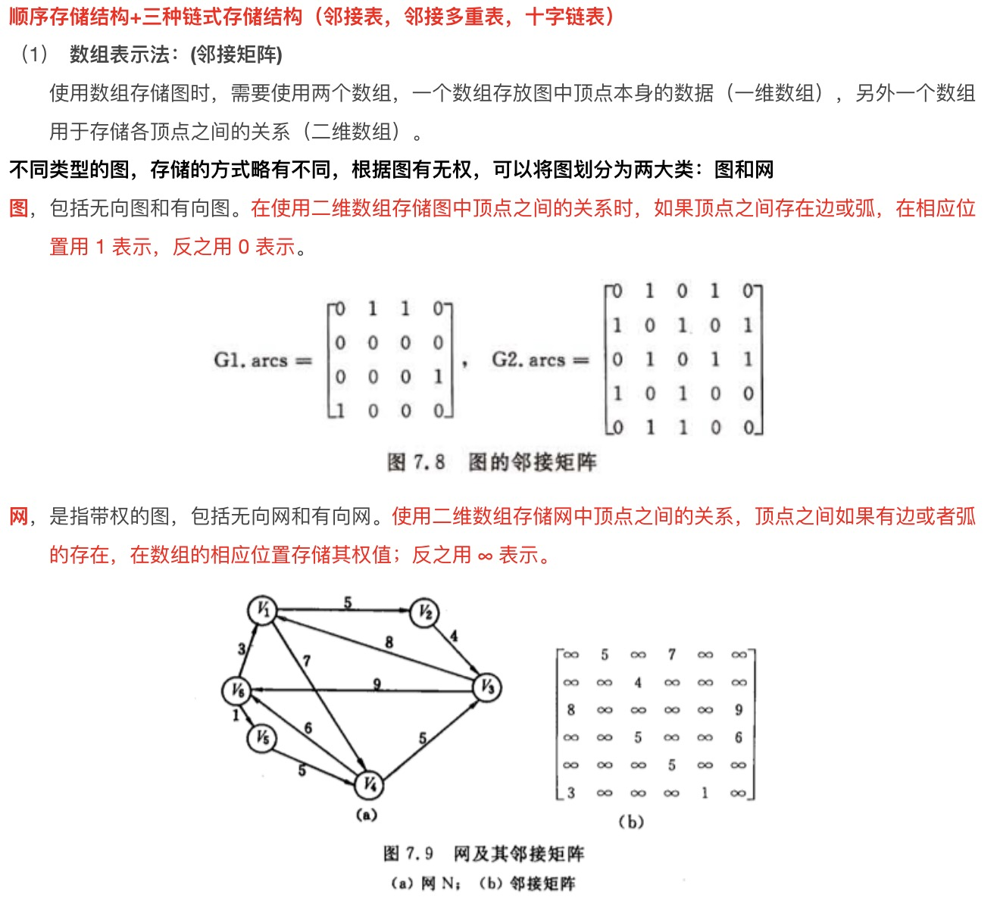

（2）邻接表

```c

#define MaxVertexNum 100               // 顶点数目的最大值

typedef struct ArcNode {               // 边表节点
  int adjvex;                          // 该弧所指向的顶点的位置
  struct ArcNode *next;                // 指向下一条弧的指针
  // InfoType info;                    // 网的边权值
}ArcNode;

typedef struct VNode{                  // 顶点表节点
  VertexType data;                     // 顶点信息  
  ArcNode *first;                      // 指向第一条依附该顶点的弧的指针
}VNode, AdjList[MaxVertexNum];

typedef struct {
  AdjList vertices;                    // 邻接表
  int vexnum,arcnum;                   // 图的顶点数和弧度
}ALGraph;                              // ALGraph是以邻接表存储的图类型

```
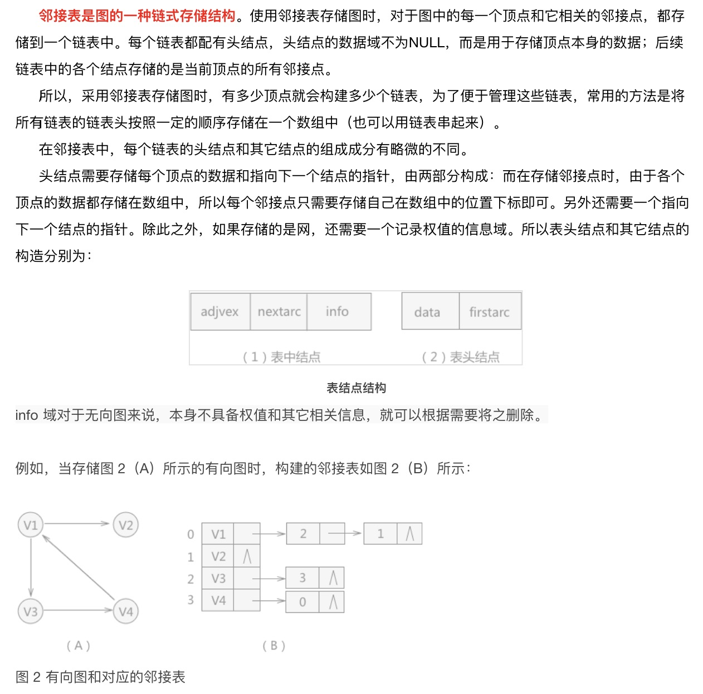

### 3、广度优先遍历和深度优先遍历

（1）`广度优先遍历（BFS）`
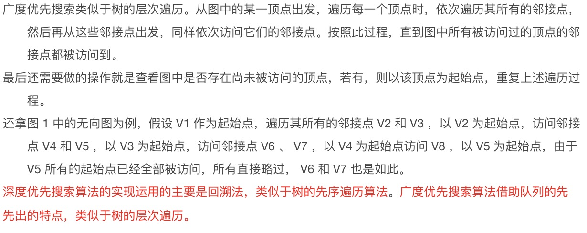

```c

bool visited[MAX_VERTEX_NUM];               // 访问标记数组

void BFSTraverse(Graph G){                  // 对G进行广度优先遍历
  for(i = 0; i < G.vexnum; ++i){
    visited[i] = FALSE;                     // 访问标记数组初始化
  }
  InitQueue(Q);                             // 初始化辅助队列Q
  for(i = 0; i < G.vexnum; ++i){            // 从0号顶点开始遍历
    if(!visited){                           // 对每个连通分量调用一次BFS
      BFS(G, i);                            // vi未访问过从vi开始BFS
    }
  }
}

void BFS(Graph G, int v){                   // 从顶点v出发，广度优先遍历图G
  visit(v);                                 // 访问初始顶点v
  visited[v]=TRUE;                          // 对v做已访问标记
  EnQueue(Q, v);                            // 顶点v入队列Q

  while(!isEmpty(Q)){
    DeQueue(Q, v);                          // 顶点v出队列
    for(w=FirstNeighbor(G, v); w>=0; w=NextNeighbor(G, v, w)){ // 检测v所有邻接点

      if(!visited[w]){                      // w为v的尚未访问的邻接顶点
        visit(w);                           // 访问顶点w
        visited[w]=TRUE;                    // 对w做已访问标记
        EnQueue(Q, w);                      // 顶点w入队列
      }
    }
  }
}

```

（2）`深度优先遍历`

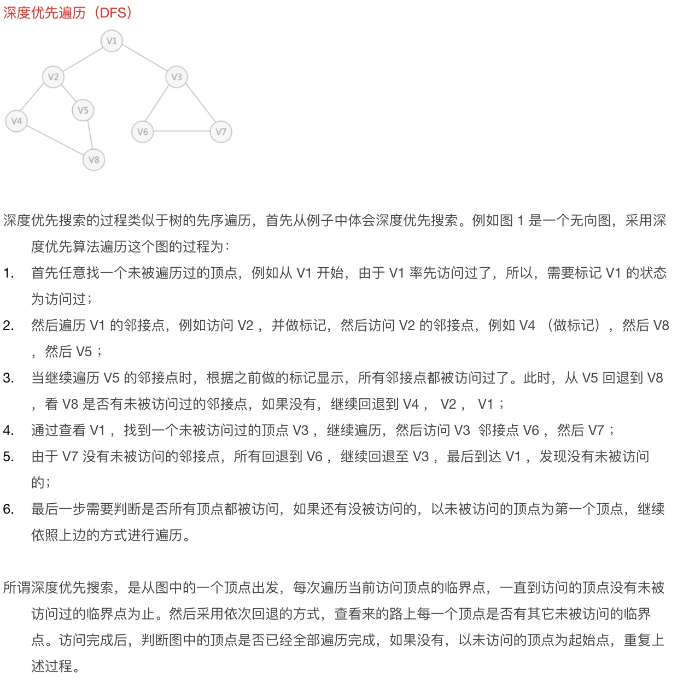

```c

bool visited[MAX_VERTEX_NUM];                // 访问标记数组
void DFSTraverse(Graph G){                   // 对图G进行深度优先遍历
  for(v = 0; v < G.vexnum; ++v){
    visited[v]=FALSE;                        // 初始化已访问标记数据
  }
  for(v = 0; v < G.vexnum; ++v){             // 本代码中是从v=0开始遍历
    if(!visted[v]) DFS(G, v);
  }
}

void DFS(Graph G, int v){                    // 从顶点v出发，深度优先遍历图G
  visit(v);                                  // 访问顶点v
  visited[v] = TRUE;                         // 设已访问标记
  for(w=FirstNeighbor(G, v); w>=0; w=NextNeighor(G, v, w)){
    if(!visited[w]){                         // w为u的尚未访问的邻接顶点
      DFS(G, w);
    }
  }
}

```

### 4、最小生成树基本概念

一个连通图的生成树包含图的所有顶点，并且仅含尽可能少的边。对于生成树来说，若砍去它的一条边，则会使生成树变成非连通图；若给它增加一条边，则会形成图中一条回路；

对于一个带权连通无向图 G=(V, E)，生成树不同，每棵树的权（即树中所有边上的权值之和）也可能不同，设R为G的所有生成树的集合，若T为R中边的权值之和最小的那颗生成树，则T称为G的最小生成树。

* 最小生成树性质如下
  （1）最小生成树不是唯一的
  （2）最小生成树的边的权值之和总是唯一的
  （3）最小生成树的边数为顶点树减一

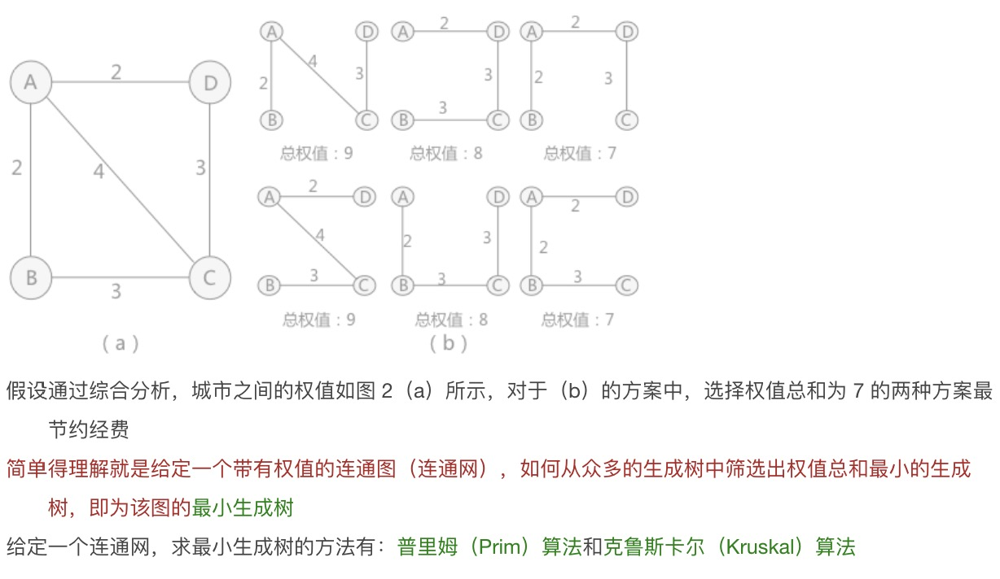

#### 4.1 Prim算法

> 初始任取一顶点加入树T，此时树中只含有一个顶点，之后选择一个与当前T中顶点集合距离最近的顶点，并将该顶点和相应的边加入T，每次操作后T中的顶点个边数都增加一。以此类推，直到图中所有顶点都并入T，得到的T就是最小生成树

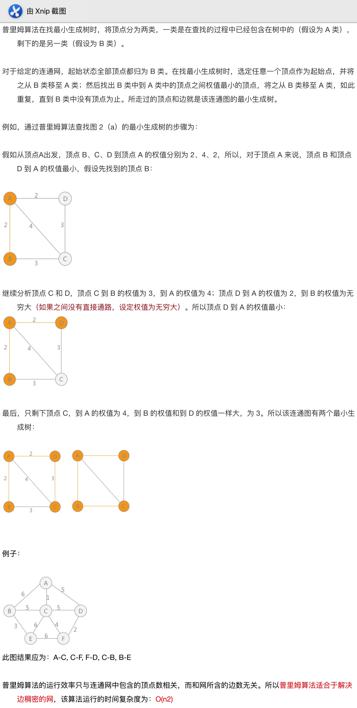

```c

```

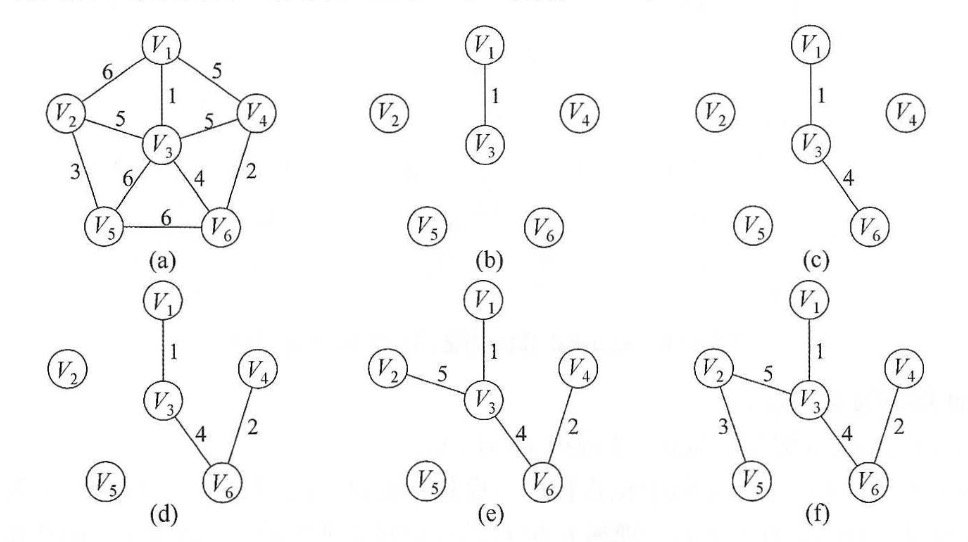

#### 4.2 Kruskal算法
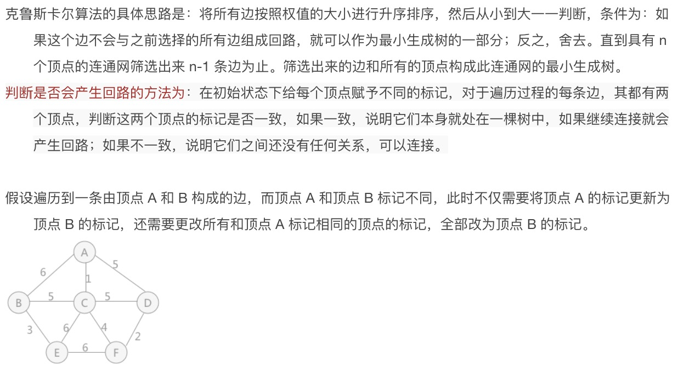

### 7、最短路径问题


### 8、Dijkstra算法
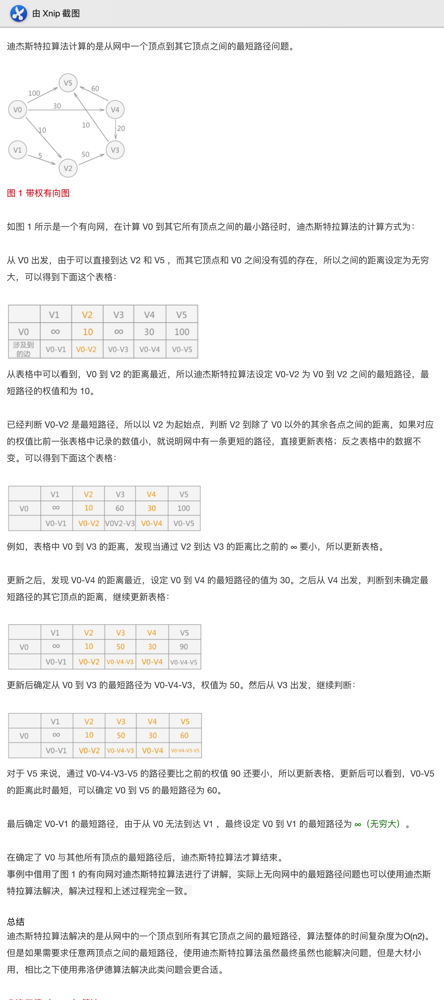

### 9、Floyd算法
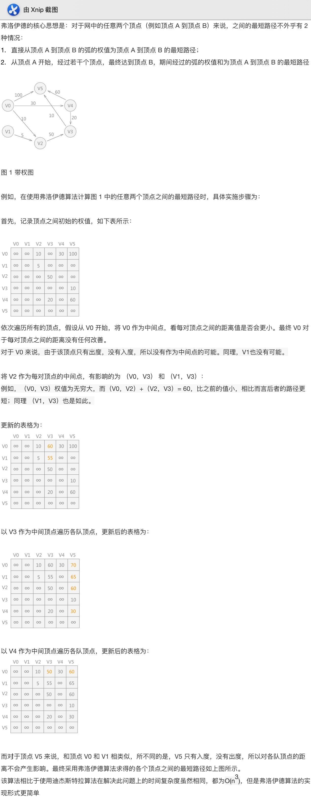

### 10、拓扑排序
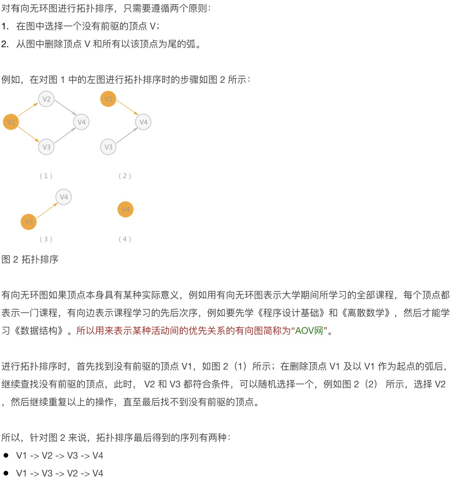
