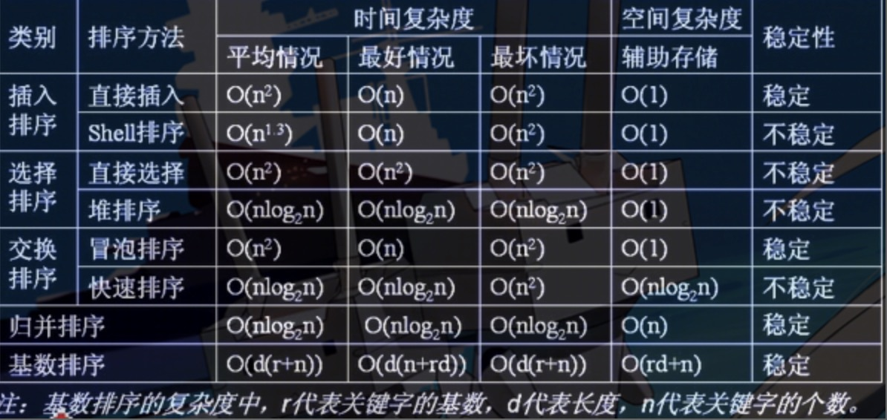
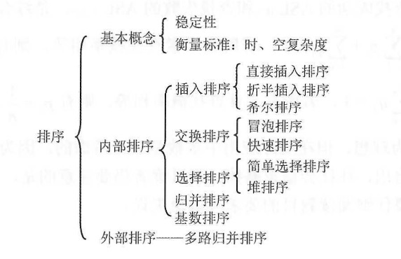

## 排序基本概念


## 知识结构


### 插入排序
* 基本思路：
    每次将一个待排序的记录按其关键字大小插入到前面已排好序的子序列中，中，直到全部记录插入完成。

（1）直接插入排序

```c
    void InsertSort(ElemType A[], int n){
        int i,j;
        // 依次将A[2]~A[n]插到前面已排好的序列
        for(i=2; i<=n; i++){
            // 若A[i]关键码小于其前驱，将A[i]插入有序表
            if(A[i] < A[i-1]){
                // 复制哨兵，A[0]不存放元素
                A[0]=A[i];
                // 从后往前找待插入位置
                for(j=i-1; A[0] < A[j]; --j){
                    // 向后挪位
                    A[j+1] = A[j]
                }
                // 复制到插入位置
                A[j+1] = A[0];
            }
        }
    }
```

* 空间复杂度： O(1)
* 时间复杂度：
最坏 => O(n)
最好 => O(n^2)
平均 => O(n^2)
>   适用于基本有序的排序表和数据量不大的排序表

（2）希尔排序
* 基本思想：先把待排列表按某个增量均分成若干个子表，对各个子表进行直接插入排序，当整个表中元素已呈“基本有序”时，再对全体记录进行一次接排序

dk = 为间隔步长
```c
    void ShellSort(ElemType A[], int n){
        // A[0]只是暂存单元，不是哨兵，当j<=0时，插入位置已到
        for(dk=n/2; dk>=1; dk=dk/2){     // 步长变化

            for(i=dk+1; i<=n; ++i){

                // 直接插入排序
                if(A[i] < A[i-dk]){      // 需要将A[i]插入有序增量子表
                    A[0] = A[i];
                    for(j=i-dk; j>0 && A[0] < A[j]; j-=dk){
                        A[j+dk]=A[j];           // 记录后移，查找插入位置
                    }
                    A[j+dk]=A[0];               // 插入
                }

            }

        }
    }
```

* 空间复杂度： O(1)
* 时间复杂度：
最好 => O(n)
最坏 => O(n^2)
平均 => O(n^1.3)
>   适用于线性表为顺序存储的情况

### 选择排序

* 基本思想：
    每一趟在后面 n-i+1 个待排序元素中选取关键字最小的元素，作为有序子序列的第i个元素，直到第 n-1 趟做完，待排序只剩下1个，就不用再选了

（1）简单选择排序
* 基本思想：将设排序表为L[1...n]，第i趟排序即从L[i...n]中选择关键字最小的元素与L(i)交换，每一趟排序可以确定一个元素的最终位置，这样经过n-1趟排序就可以使得整个排序表有序

```c
void SelectSort(ElemType A[], int n){
    for(i = 0; i < n-1; i++){              // 一共进行n-1趟
        min=i;                             // 记录最小元素位置
        for(j = i+1; j < n; j++){          // 在A[i...n-1]中选择最小的元素
            if(A[j] < A[min]){
                min = j;                   // 更新最小元素的位置
            }
        }
        if(min != i){
            swap(A[i], A[min]);            // 封装的swap()函数共移动元素3次
        }
    }
}
```

* 空间复杂度： O(1)
* 时间复杂度：
最好 => O(log2n)
最坏 => O(n^2)
平均 => O(log2n)


（2）堆排序
* 基本思想：
    比如大顶堆，在构建时，从底向上比较各级子树，将最大值往父节点推，最后到达树根；在将最大值从树根推出之后，将最末尾的节点p放在树根位置，然后从顶向下比较，将p放到合适的位置

void BuildMaxHeap(ElemType A[], int Len){
    // 最后一个节点是第[len/2]个节点的孩子
    for(int i=len/2; i> 0; i--){         
        HeadAdjust(A, i, len);
    }
}

void HeadAdjust(ElemType A[], int k, int len){
    A[0]=A[k];
    for(i = 2*k; i <= len; i *= 2){
        if(i < len && A[i] < [i+1]){
            i++;
        }
        if(A[0]>=A[i];) break;
        else {
            A[k] = A[i];
            k=i;
        }
    }
    A[k]=A[0];
}

// 入口
void HeapSort(ElemType A[], int Len){
    BuildMaxHeap(A, len);
    for(i=len; i>1; i--){
        Swap(A[i], A[l]);
        HeadAdjust(A, 1, i-1);
    }
}


### 快速排序（`是所有内部排序算法中平均性能最优的排序算法`）
* 基本思想：基于分治法

```c
    void ShellSort(ElemType A[], int low, int high){
        if(low < high){
            int pivotpos=Partition(A, low, high);
            QuickSort(A, low, pivotpos);
            QuickSort(A, pivotpos+1, high);
        }
    }

    int Partition(ElemType A[], int low, int high){
        ElemType pivot=A[low];            // 将当前表中第一个元素设为驱轴，对表进行划分
        while(low < high){                // 跳出循环体条件
            while(low < high && A[high] >= pivot){
                --high;
            }
            A[low]=A[high];          // 将比驱轴小的元素移动到左端
            while(low < high && A[low] <= pivot){
                ++low;
            }
            A[high]=A[low];          // 将比驱轴大的元素移动到右端
        }
        A[low]=pivot;                // 驱轴元素放到最终位置
    }
```

* 空间复杂度： O(log2n)
* 时间复杂度：
最好 => O(log2n)
最坏 => O(n^2)
平均 => O(log2n)

### 归并排序
* 基本思路：
    将两个或两个以上的有序表组合成一个新的有序表，两两归并，如此反复，直到合并成一个长度为n的有序表为止
    
```c
    ElemType *B = (ElemType *)malloc((n+1)*sizeof(ElemType)); // 辅助数组B

    void Merge(ElemType A[], int low, int mid, int high){
        // 表A的两段[low...mid]和[mid+1...high]各自有序，将他们合并成一个有序表
        for(int k=low; k<=high; k++){
            B[k]=A[k];                     // 将A中所有元素复制到B中
        }
        for(i=low, j=mid+1, k=i; i<=mid && j<=high; k++){
            if(B[i] <= B[j]){              // 比较B的左右两段中的元素
                A[k]=B[i++];               // 将较小值复制到A中
            }else{
                A[k]=B[j++];
            }
        }
        while(i<=mid) A[k++] = B[k++];     // 若第一个表未检测完，复制
        while(j<=high) A[k++] = B[k++];     // 若第二个表未检测完，复制
    }

    void MergeSort(ElemType A[], int low, int high){
        if(low <= high){
            int mid = (low + high)/2;              // 从中间划分两个子序列
            MergeSort(A, low, mid);                // 对左侧子序列进行递归排序
            MergeSort(A, mid+1, high);             // 对右侧子序列进行递归排序
            Merge(A, low, mid, high);              // 归并
        }
    }
```

### 基数排序
[基数排序视频](https://www.bilibili.com/video/BV1wa4y177rX?from=search&seid=1731034378611931942)