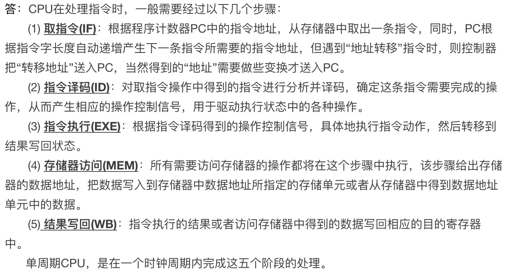

#### CPU中的时序电路
答：CPU中的时序电路：通过RS触发器控制CPU的时序。

#### 单周期处理器的设计

#### 流水线处理器的基本原理
答：`流水线(Pipeline)技术是指程序在执行时候多条指令重叠进行操作的一种准并行处理实现技术`。通俗的讲将一个时序过程，分解成若干个子过程，每个过程都能有效的与其他子过程同时执行。旨在提高处理器处理效率，争取在一个时钟周期中完成一条指令。
将处理组织成阶段：`取指、译码、执行、访存、写回`。
`通常一条指令包含很多操作`，可以将它们组织成一定的阶段序列，从而便于放入一个通用框架来进行流水线处理。
参考：
流水线处理器的基本原理：https://blog.csdn.net/pankul/article/details/8769979

#### Data Hazard的处理
答：流水线给处理器带来了效率，当然也有问题。称之为流水线冒险(HaZard)。
1、`结构冒险`
`由于处理器资源冲突，而无法实现某些指令或者阶段的组合实现，就称之为处理器有结构冒险。`
比如，早期的处理器中，程序和数据是存储在一起的，那么容易出现下图的情况：在第四个cycle中，IF和MEM同时访问存储器导致有一个操作要等待，此时hazard就出现了。现在的处理器已经解决了该问题：指令存储在L1P cache中，数据存储L1D cache中，单独访问，不会影响相互操作。
2、`数据冒险`
`如果流水线中原来有先后顺序的指令同一时刻处理时，可能会导致出现访问了错误的数据的情况。`
在汇编语句中，add R1,R2,R3 将寄存器R2和R3的和赋予R1，改变R1的值；而紧接着下面的语句：add R4,R1,R5则会使用R1的值，可是R1必须在第一条语句中的第5个cycle才能更新到寄存器中，语句二是在第4个cycle就要访问R1，也就是说第二,条指令此时在使用错误的R1的值。这是数据hazard出现了。
`解决方案：在两条指令中添加一条空指令：nop。`但是会影响处理器的指令的执行效率。在现代处理器技术中，已经用forwarding的方式解决了。如下图，如果处理器在检测到当前指令的源操作数正好在流水线的EX或者MEM阶段，接直接将ex和mem寄存器的值传递给ALU的输入，而不是再从寄存器堆中获取数据了。因为此时寄存器堆中的数据可能是没有被及时更新的。
3、`控制冒险`
`在流水线中的的执行指令时，由于并行处理的关系，后面很多指令其实都在流水线中开始处理了，包括预取值和译码。那么，如果此时程序中出现一条跳转语句怎么办呢？`因为程序已经跑到其他地址处执行，流水线中之前已经做好的预取值和译码动作都不能使用了。这些会被处理器的专有部件flush掉，重新开始新的流水线。此时我们可以称之为出现了控制hazard。这种情况对于程序和效率来说是存在很大损失的。
`解决方案：也就是在jump指令后面(不会被真正使用，但是会进入流水线)添加nop。`在MIPS程序中，经常在jump指令后面添加nop语句。
在X86架构中，是通过硬件来实现flush，将无效的流水线排空，以保证正确运行流水线。这里会涉及到分支预测技术的使用。
在其他一些处理器中，用软件的方式来处理，添加nop。同时在编译器中通过乱序的思想用有效指令代替nop。这样也可以避免转跳带来的性能损失。

#### 流水线设计汇总的其他问题
答： 1、每个阶段所用的硬件实际并不是相互独立的；增加的寄存器也会导致延迟增大；每阶段的周期划分也很难做到一致。
       2、理想的流水线系统，每个阶段的时间都是相等的。实际上，各个阶段的时间是不等的。运行时钟是由最慢的阶段决定的。
       3、另外流水线过深，寄存器的增加会造成延迟增大。当延迟增大到时钟周期的一定比例后，也会成为流水线吞吐量的一个制约因素。

