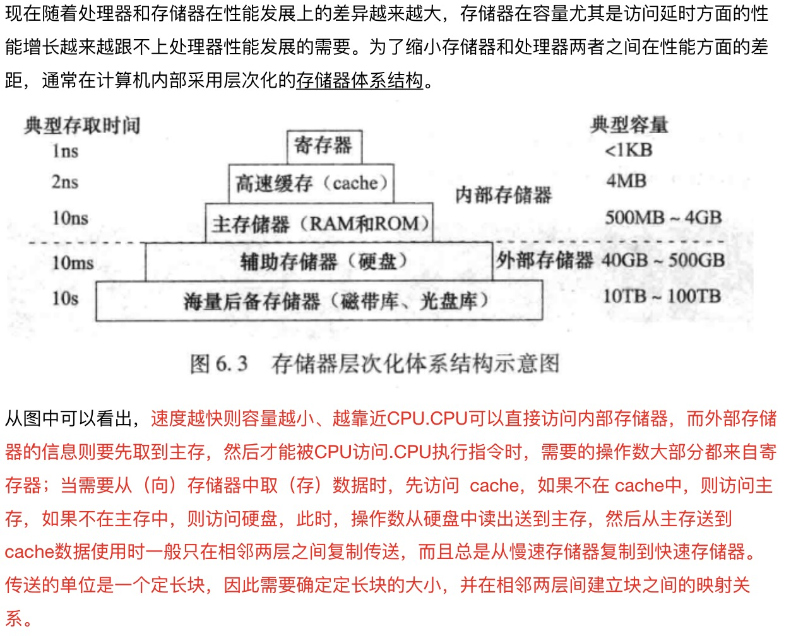
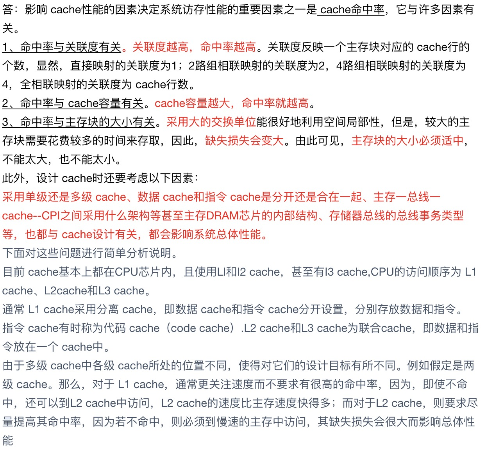
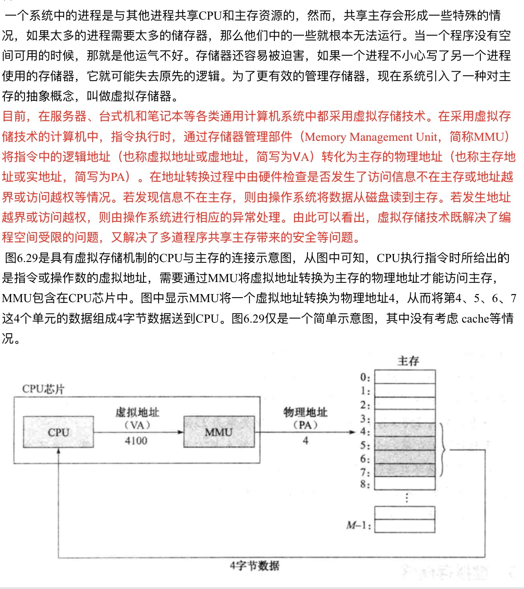
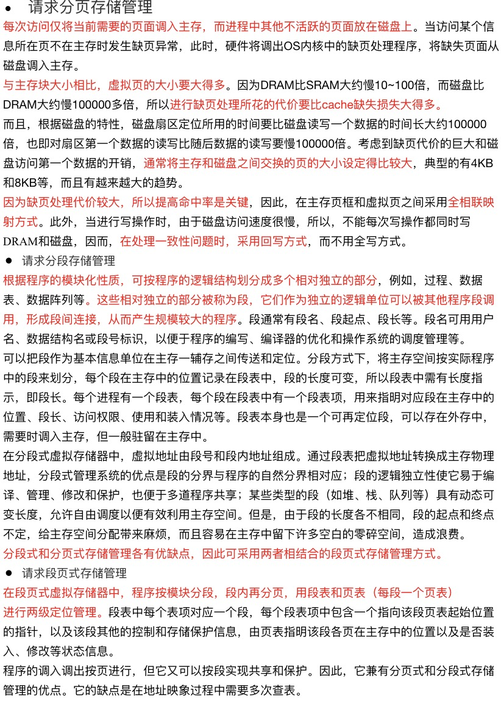
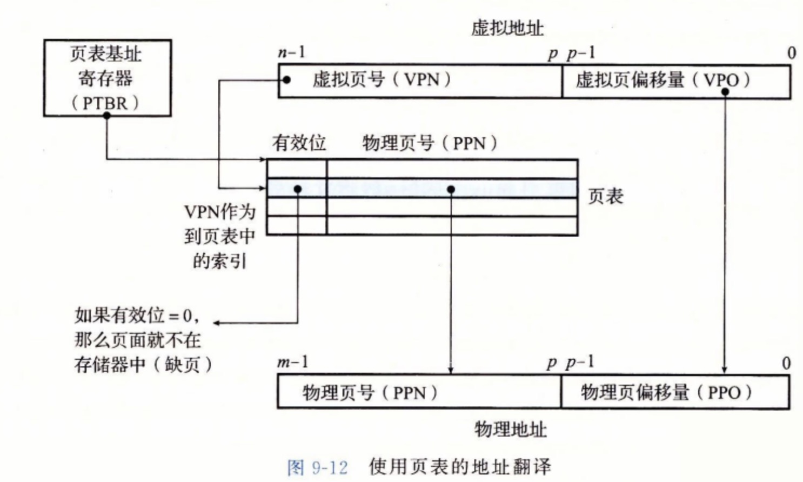
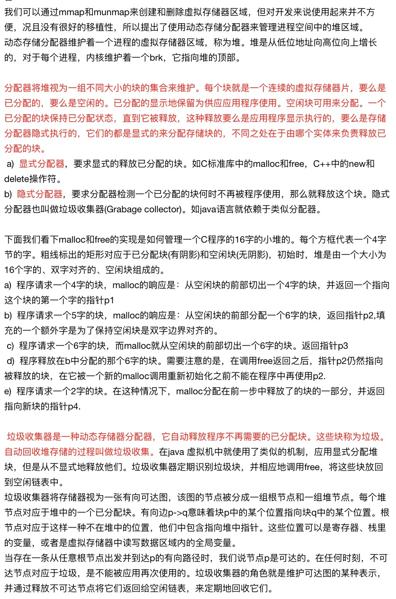

#### 局部性
一个编写良好的计算机程序常具有良好的局部性。
引用邻近于其他最近引用过的数据项的数据项，或者最近引用过的数据项本身。这种倾向性，被称为局部性原理。
局部性两种形式：
  `时间局部性 被引用过一次的内存位置很可能在不远的将来再被多次引用。`（通常在循环中）
  `空间局部性 一个内存位置被引用了一次，那么将来他附近的位置也会被引用。`

局部性与性能的关系
有良好局部性的程序比局部性差的程序运行得更快。
  1局部性原理允许计算机设计者通过引入称为高速缓存存储器来保存最近被引用的指令和数据项，从而提高对主存的访问速度。
  2重复引用相同变量的程序有良好的时间局部性。
  3对于具有步长为k的引用模式的程序，步长越小，空间局部性越好。
  4具有步长为l的引用模式的程序有很好的空间局部性。
  5在内存中以大步长跳来跳去的程序空间局部性会很差。
  6对于取指令来说，循环有好的时间和空间局部性。
  7循环体越小，循环迭代次数越多，局部性越好。

#### 存储器层级结构

#### 计算器高速缓存器原理
加快CPU访存速度的主要方式之一是在CPU和主存之间增加高速缓冲存储器（简称高速缓存或 cache）。
`cache是一种小容量高速缓冲存储器，由快速的SRAM组成，直接制作在CPU芯片内，速度较快，几乎与CPU处于同一个量级。在CPU和主存之间设置 cache，总是把主存中被频繁访问的活跃程序块和数据块复制到 cache中。由于程序访问的局部性，大多数情况下，CPU能直接从 cache中取得指令和数据，而不必访问慢速的主存`
为便于 cache和主存间交换信息，cache和主存空间都被划分为相等的区域。
例如，将主存按照每512字节划分成一个区域，同时把 cache也划分成同样大小的区域，这样主存中的信息就可按照512字节为单位送到 cache中。
我们把主存中的区域称为块，也称为主存块，它是 cache和主存之间的信息交换单位；cache中存放一个主存块的区域称为行或槽，也称 cache行。

#### 高速缓存对性能的影响

#### 地址空间
每个高级语言源程序经编译、汇编、链接等处理生成可执行的二进制机器目标代码时，都被映射到同样的虚拟地址空间，因此，所有进程的虚拟地址空间是一致的，这简化了链接器的设计和实现，也简化了程序的加载过程。
虚拟存储机制为程序提供了一个极大的虚拟地址空间（也称为逻辑地址空间），它是主存和磁盘存储器的抽象。虚存机制带来了一个假象，使得每个进程好像都独占使用主存，并且主存空间极大。
这有三个好处：
● 每个进程具有一致的虚拟地址空间，从而可以简化存储管理
● 它把主存看成是磁盘存储器的一个缓存，在主存中仅保存当前活动的程序段和数据区，并根据需要在磁盘和主存之间进行信息交换，使有限的主存空间得到了有效利用；
● 每个进程的虚拟地址空间是私有的，因此，可以保护各自进程不被其他进程破坏。

#### 虚拟存储器

#### 虚拟内存管理

#### 翻译和映射

#### TLB
地址转换过程中，访存时首先要到主存查页表，然后才能根据转换得到的物理地址再访问主存以存取指令或数据。如果缺页，则还要进行页面替换、页表修改等，访问主的次数就更多。因此，采用虚拟存储机制后，使得访存次数增加了。为了减少访存次数，`往往把页表中最活跃的几个页表项复制到高速缓存中，这种在高速缓存中的页表项组成的页表称为后备转换缓冲器（Translation Lookaside Buffer，简称TLB），通常称为快表`，相应地称主存中的页表为慢表

#### 动态存储器分配和垃圾回收
