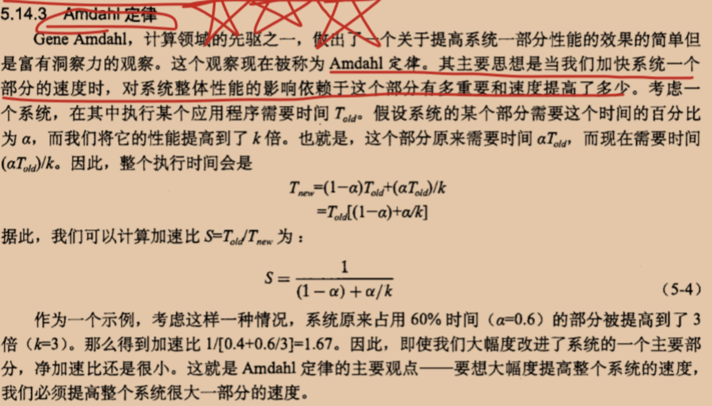

#### 优化程序性能
程序优化的第一步就是`消除不必要的内容`，让代码尽可能有效地执行它期望的工作。这包括消除不必要的函数调用、条件测试和存储器引用。这些优化不依赖于目标机器的任何具体属性。
2、程序优化的第二步，`利用处理器提供的指令级并行能力，同时执行多条指令。`
3、最后对大型程序的优化，`使用代码剖析程序，代码剖析程序是测量程序各个部分性能的工具这种分析能够帮助找到代码中低效率的地方`，并且确定程序中应该着重优化的部分
4、`Amdahl定律，它量化了对系统某个部分进行优化所带来的整体效果`

#### 优化编译器的能力和局限性以及表示程序性能
`优化编译器的能力`：
现代编译器运用复杂精细的算法来确定一个程序中计算的是什么值，以及它们是被如何使用的。然后它们会利用一些机会来简化表达式，在几个不同的地方使用同一个计算，以及降低一个给定的计算必须被执行的次数。
`优化编译器的局限性`：
编译器必须很小心地对程序只是用安全的优化，也就是说对于程序可能遇到的所有可能的情况，在C语言标准提供的保证之下，优化后得到的程序和未优化的版本有一样的行为，限制编译器只进行安全的优化，消除了一些造成不希望的运行时行为的可能原因，但是这也意味着程序员必须花费更大的力气写出程序使编译器能够将之转换成有效机器代码，
`两个指针可能指向同一个存储器位置的情况称为存储器别名使用（memory aliasing）`。
这造成了一个主要的妨碍优化的因素，这也是可能严重限制编译器产生优化代码机会的程序的一个方面：如果编译器不能确定两个指针是否指向同一个位置，就必须假设什么情况都有可能，限制了可能的优化策略。
`表示程序性能：`
引入度量标准`每元素的周期数（Cycles Per Element  CPE）`,作为一种表示程序性能并指导我们改进代码的方法
使用最小二乘方拟合，得到一条形如y=mx+b的线，线性因子的系数m叫做每元素的周期数CPE的有效数

#### 特定体系结构或应用特性的性能优化
 1、`简单地使用命令行选项如‘-O1’就会进行一些基本的优化。`
 2、`消除循环的低效率`：称作‘代码移动’，这类优化包括识别要执行多次（例如在循环里）但是计算结果不会改变的计算，因而将计算移动到代码前面不会被多次求值的部分
 3、`减少过程调用`：修改代码减少函数的调用，不过会损害一些程序的模块性
 4、`循环展开`：通过增加每次迭代计算的元素的数量，减少循环的迭代次数。从两个方面改程序的性能，首先它减少了不直接有助于程序结果的操作的数量，例如循环索引计算和条件分支。其次，它提供了一些方法，可以进一步变化代码，减少整个计算中关键路径上的操作数量
 5、`提高并行性`：1.多个累积变量 2.重新结合变换

#### 限制因素
`1、寄存器溢出：循环并行性的好处受到描述计算的汇编代码的能力限制。`
      特别地，IA32指令集只有很少量的寄存器来存放积累的值（IA32只有4个，x86-64可以12个）。如果我们的并行度p超过了可用的寄存器数量，那么编译器会诉诸溢出（spilling），将某些临时值存放到栈中。一旦出现这种情况，性能会急剧下降。
`2、 分支预测和预测错误处罚`：当分支预测逻辑不能正确预测一个分支是否要跳转的时候，条 件分支可能会招致严重的预测错误处罚。
`3、 对于这个问题没有简单的答案，有一些通用原则`
   1).不要过分关心可预测的分支
   2).书写适合用条件传送实现的代码

#### 确认和消除性能瓶颈
处理大程序时连知道该优化什么地方都很困难。
* 程序剖析：程序剖析包括运行程序的一个版本，其中插入了工具代码，以确定程序的各个部分需要多少时间，这对于确认需要集中注意力优化的部分很有用，剖析的一个有力指出在于可以在现实的基准数据上运行实际程序的同时，进行剖析（Unix系统提供了一个剖析程序GPROF）。通常，假设在有代表性的数据上运行程序，剖析能帮助我们对典型的情况进行优化，但是我们还应该确保对所有可能的情况，程序都有相当的性能。这主要包括避免得到糟糕的渐近性能的算法（例如插入算法）和坏的编程实践
* Amdahl定律：其主要思想是当我加快系统一个部分的速度时，对系统整体性能的影响依赖于这个部分有多重要和速度提高了多少。

