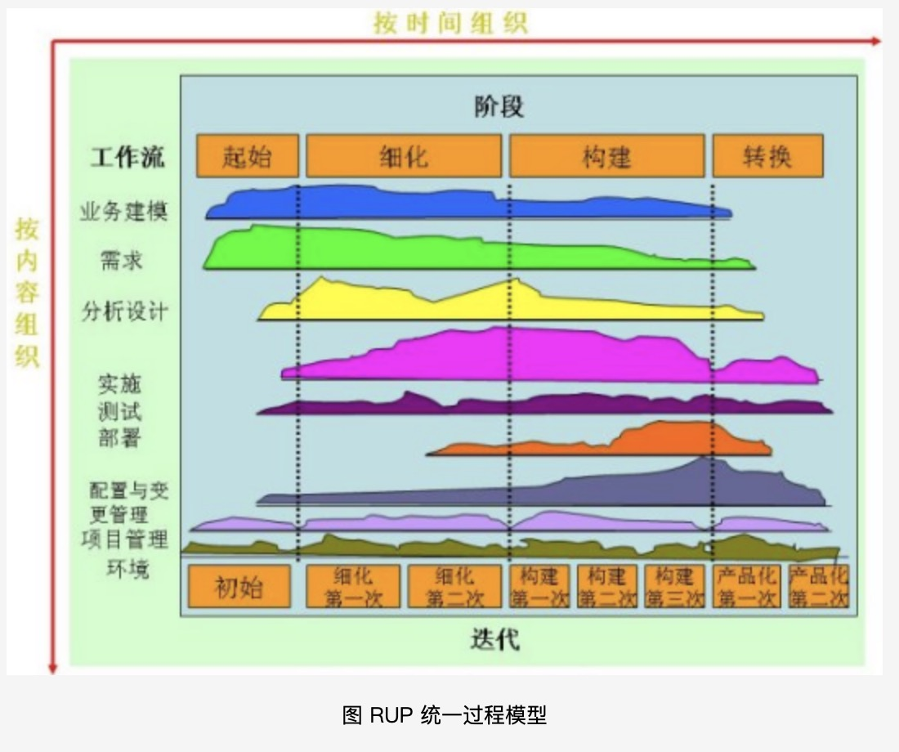
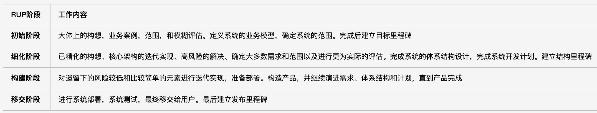

#### 软件过程概念

> 软件过程是指软件整个生命周期，从`需求获取，需求分析，设计，实现，测试，发布，维护`一个过程的模型。 

> 一个软件过程定义了软件开发中采用的方法，但软件过程还包含该过程中应用的技术-----技术方法和自动化工具。

> 过程定义一个框架，为有效交付软件工程技术，这个框架必须创建。软件过程构成了软件项目管理控制的基础，并
> 创建了一个环境以便于技术方法的采用、工作产品（模型、文档、报告、表格等）的产生、里程碑的创建、质量的保证
> 正常变更的正确管理  

#### 瀑布模型、增量模型、演化模型、过程统一模型 （待补充）

* 1、瀑布模型

> 定义： 将软件生命周期划分为`制订计划、需求分析、软件设计、程序编写、软件测试、运行维护`等六个基本活动，
>       并且规定了它们自上而下、相互衔接的固定次序

> 缺点：（1）各个阶段划分完全固定，阶段之间产生大量的文档，极大的增加了工作量；
>      （2）由于开发模型是线性的，用户只能等到整个过程末期才能看到开发成果，从而增大开发风险；
>      （3）早期的错误可能要等到开发后期的测试阶段才能发现，进而带来严重的后果。

* 2、增量模型

> 定义： 增量模型将软件的开发过程分成若干个日程时间空错的线性序列，每个线性序列产生软件的一个可发布的“增量”版本、后一个版本是对前一个版本的修改和补充，重复增量发布的过程直至产生最终完善的产品。
>   增量模型融合了瀑布模型的基本成分（重复应用）和演化模型和迭代特征，强调每一次增量都发布一次可运行的产品。
>   适用于需求经常发生变化的软件开发。使用增量模型时

* 3、演化模型

> 定义：大量实践表明，许多软件项目在开发早期对软件需求的认识都是模糊的、不确定的，因此软件很难一次开发成功。为了减少因为对需求了解不明确而给软件开发带来的风险，可在获取一组基本需求后，通过快速分析，构造出该软件的一个初始可运行版本，通常称之为“原型”。然后用户在试用原型的过程中提出意见和建议，或者增加新的需求，对原型进行改造，获得原型的新版本。重复这一过程，最终得到令客户满意的软件产品。
>   采用演化模型的开发过程，实际上就是从构造的原型出发，逐步将其演化成最终软件产品的过程。演化模型特别适用于对软件需求缺乏准确认识的情况，典型的演化模型有增量模型、原型模型和螺旋模型。

* 4、 统一过程模型(RUP/IP , Rational Unified Process)
> 是一种以用例驱动，以体系结构为核心，迭代及增量的软件过程模型，由UML方法和工具支持，广泛应用于各类面向对象项目

（1）RUP的二维结构
> 横轴按时间组织，显示RUP的动态特征，通过迭代式软件开发的周期、阶段、迭代和里程碑等动态信息表示；  
> 纵轴按内容组织，显示RUP的静态特征，通过过程的构建、活动、工作流、产品和角色等静态概念来描述系统
`其中每个工作流的高度体现随时间变化工作量的变化，早期的迭代趋向于更多的需求和设计，后期则减少这方面的工作`

（2）RUP的静态结构
> 6个核心工作流：业务建模、需求、分析设计、实现、测试、部署;
> 3个核心支持工作流：配置与变更管理、项目管理和环境;

| 工作流 | 制品 | 工作内容 | 
| --- | ---- | -------- |
| 业务建模 | 商业逻辑建模；业务需求说明书；专业词汇表；风险说明；复审说明书 |  |
| 需求 | 用例图 | 了解目标组织的结构及机制；明确目标组织中当前存在的问题并确定改进的可能性；确保客户、最终用户、开发人员就目标组织达成一致；导出支持目标组织所需的系统需求 |
| 设计分析 |  | 将系统需求转化为未来系统的设计，逐步开放强壮的系统架构，使设计适合于实施环境，为提高性能而进行设计 |
| 实施 |  | 定义代码结构，以构件的方式实施类和对象，对已开发的构件按类和单元来测试，并且将结果集成到可执行的系统 |
| 测试 |  | 测试仅限于对各个类进行单元测试，测试工作流包括：核实对象之间的交互；核实软件的所有构件是否正确集成；核实所有需求是否已经正确实施；确定缺陷，确保在部署软件之前将风险降到最低；s |

（2）RUP的四个阶段

#### 过程评估与CMM/CMMI的基本概念

* 1、过程评估

> 概念： 软件过程评估所关注的是软件组织自身内部软件过程的改进问题，目的在于发现缺陷，提出改进的方向

* 2、CMM (Capability Maturity Model， 能力成熟模型)

> CMM是国际公认对软件公司进行成熟度等级认证的重要标准，它目的是提供一种评价软件承接方能力的方法，同时帮助软件组织改进其软件的过程

> CMM共分五级。在每一级中，定义了达到该级过程管理水平所应解决的关键问题和关键过程。每一较低级别是达到较高级别的基础。
> 其中：
>    五级为最高级，即优化级，达到该级的软件公司过程自发的不断改进，防止同类问题二次出现；
>    四级为已管理级，达到该级的软件公司已实现过程的定量化；
>    三级为已定义级，即过程实现标准化；
>    二级为可重复级，达到该级的软件公司过程已制度化，有纪律，可重复；
>    一级为初始级，过程无序，进度，预算，功能和质量等方面不可预测；

* 3、CMMI (Capability Maturity Model Integration，能力成熟度模型集成)

> 将各种能力成熟度模型，即：Software CMM、 Systems Eng-CMM、 People CMM和Acquisition CMM， 整合到统一架构中去
> 由此建立起包括软件工程、系统工程和软件采购等在内的诸模型集成，以解决除软件开发外的软件系统工程和软件采购工作中的迫切需求

> 基本思路：
> 1、解决软件项目过程的改进难度增大问题
> 2、实现软件工程并行与多学科组合
> 3、实现过程改进的最佳效益

#### 敏捷宣言与敏捷过程的特点

* 1、敏捷宣言（也叫“敏捷软件开发宣言”）

> 宣布了四种核心价值和十二条原则，指导迭代的以人为中心的软件开发方法

> 宣言强调的四个核心价值：
>   1、个体和互动 高于 流程和工具
>   2、工作的软件 高于 详尽的文档
>   3、客户合作 高于 合同谈判
>   4、响应变化 高于 遵循计划

* 2、敏捷过程的特点

> 与传统开发过程相比，在敏捷开发的整个过程中，有以下几个主要特点：

> 1、`敏捷开发的过程有着更强的适应性而不是预设性`，体现其适应性的方面：

> （1）缩短把项目提交给用户的周期；
> （2）增加用户，业务人员，开发人员这三者之间的交流；
> （3）通过减少重构成本以增加软件适应性；

> （从敏捷宣言的第四条响应变化高于预设计划便可以看出。因为软件开发过程本身的不可预见性，很多用户在项目开始时不可能对于这个项目有着一个完整而明确的预期。很多对于软件的预期都在后期的修改和完善过程中产生。因此高适应性显然更加符合软件工程开发的实际。）

> 2、`敏捷开发的过程中，更加注重人的因素。`

> （在传统软件工程中，个人的因素很少的被考虑到分工中，每个个体都是只是整个代码开发机器的一个小小的螺丝钉，个人的意志和创造力很大程度上的被抹去为了更好的为集体服务。而在敏捷开发过程中，每个个人的潜力被充分的考虑，应用什么技术很大程度上直接由在第一线开发的技术人员决定；每个人的特点和创造力都可以充分地发挥，这样开发出来的软件更加的具有生命力，因为他融入了开发者的心血）

> 3、`在敏捷开发的过程中，整个项目是测试驱动的而不是文档驱动的`
> （不仅每个模块有着自己的相应的测试单元，开发人员在开发自己的模块的过程中必须保证自己所开发的模块可以通过这一单元的测试，并且集成测试贯穿了整个开发过程的始终。集成测试每天会进行十几次甚至几十次，而不是像传统方法一样只有当各个模块的编码都结束了之后再进行联合调试。这样，在软件开发的进程中每一点改动所引起的问题都容嘉容易暴露出来，使得更加容易在错误刚刚产生的时候发现问题从而解决问题。这样就避免了在最后整个系统完成时错误隐藏的太深给调试造成极大的困难。）

