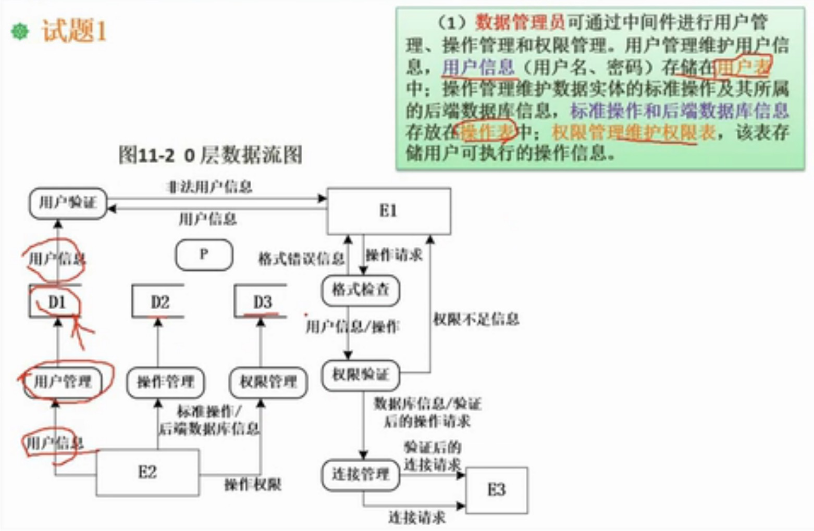

#### 软件需求的概念

* 软件需求是:
> 以一种技术形式，描述一个产品应该具有的功能、性能和其他性质

#### 需求工程的基本过程
>划分5个独立阶段
> 1、`需求获取`：通过与用户的交流，对现有系统的观察及对任务进行分析
> 2、`需求分析与协商`：分析每个需求与其他需求的关系以检查要求的一致性、重叠和遗漏的情况，并根据用户的要求对需求进行排列
> 3、`需求建模`：通过合适的工具和符号系统地描述需求
> 4、`需求规约`：给出目标软件的各种需求
> 5、`需求验证`：对功能的正确性、完整性和清晰性以及其他需求给予评价
> 6、`需求管理`：对需求工程所有相关活动的规约和控制

#### 分层数据流模型

* 题目（1）

> 答案

* 题目（2）

> 答案

#### "用例和场景建模"及其UML表达（用例图、活动图、时序图）

（1）`用例图`
  * 参与者：表示和系统进行交互的参与角色，用“小人”表示
  * 用例：表示外部可见的系统功能，用“椭圆”表示
  * 边界：指系统与系统之间的界限，用“矩形”表示
  * 参与者与用例之间关系：
    a、关联：用“实线加箭头”表示，比如，用户与用例之间
    b、泛化：用“实线 + 空心箭头”表示，一般用来表示一个继承关系，比如：对参与者组、用例组分别都可以进行泛化，箭头指向父
    
    c、包含：用“虚线加箭头 +《includes》”表示，箭头指向子功能（用例）
    

    d、扩展：用“虚线加箭头 +《extends》”表示，箭头指向父功能（用例）
    

> 其中：“扩展”和“包含”区分点： `扩展用例`是在主体用例在特定条件下才触发，`包含用例`是在主体用例在所有条件下都能触发

案例：

（2）`活动图（即泳道图，是对用例图的进一步细化）`
  * 初始节点：用一个“实心圆”表示
  * 活动终点：用一个“圆圈内加实心圆”表示
  * 活动节点：用一个“四角圆括”表示
  * 转换：从一个活动到另一个活动，用一条“带箭头的直线”来表示
  * 逻辑判断：即判断分支，用一个“菱形”表示
  * 分叉与汇合：用一个类似于“二极管”符号表示
  * 不同用户：用“泳道”表示

（3）`时序图（即顺序图，时序图是一个二维图，可以直观描述并发进程，消息在对象之间横向传递，依照时间顺序纵向排列）`

  * 横轴：表示对象
  * 纵轴：表示时间

  * 角色：可以指人、其他系统、子系统
  * 对象：代表时序图中的对象在交互中所扮演的角色 
    >对象有三种表述: 
    >   第一种: 包含对象名和类名
    >   第二种: 只显示“类名”不显示对象名，即表示他是一个匿名对象
    >   第三种: 只显示“对象名”不显示类名
  * 时间线（生命线）：在时序图中表示为从对象图标向下延伸一条虚线，表示对象存在的时间
  * 控制焦点/激活时间：是时序图中表示时间的符号，在这个时间段内对象将执行相应操作，用小矩形表示
  * 消息：
    

    > 消息分3种：
    >   同步消息：用“实线 + 实心箭头”表示
    >   异步消息：用“实线 + 折线箭头”表示，返回用虚线
    >   自关联消息：表示方法的自身调用或者一个对象内的一个方法调用另一个方法
    

  * 组合片段
    alt
    

    loop
    

    opt
    
    
    par(并行)
    

案例：
    
    

#### "数据模型建模"及其UML表达（类图）

（1）`类`：用三层结构
  * 类名：第一层
  * 属性：第二层
  * 行为：第三层

  * 可访问状态:
  >  private: 用“-”； 
  >  public:  用“+”；
  >  protected: 用“#”
  >  package/default: 用“～”，意味只要在同一包中任何其他类都可以使用它

案例
    

（2）`联系`
  * 继承：用“实线 + 空心箭头”表示 
  * 关联：没有依赖性，用“实线”表示，比如“可能只是聊天关系”
  * 聚合：外部 整体与部分 的关系，部分非强依赖整体，比如：爬行类与乌龟，用“空心菱形 + 实线”表示
  * 组合： 内部 整体与部分关系，部分强依赖整体，比如：房子与此房子内部卧室，用“实心菱形 + 实线”表示
    

  * 多重性：即允许对关系设置“数字约束”，如下
  > 表示每个访客中心有且仅有一个大厅
  > 表示每个访客中心至少有一个（1..*）
    
    0..1: 表示 0到1个
    n: 具体数字
    0..*: 0到多个
    1..*: 1到多个
    m..n: m到n个

案例：
    

#### "行为模型建模"及其UML表达（状态图即活动图，见上）

* 用例图
    

* 发布帖子活动图
    

* 查找帖子活动图
    

* 发布帖子类图
    

* 查找帖子类图
    

* 时序图
    

⚠️注意：
（1）用例图：
用例和用例之间：包含（虚线箭头+字）、扩展（虚线箭头+字）、泛化（实线空心箭头）
用例和人之间：关联（实线箭头）
人与人之间：泛化（实线空心箭头）

（2）类图
关联；实线加箭头
继承：虚线加箭头
聚合：空心菱形加实线
组合：实心菱形加实线